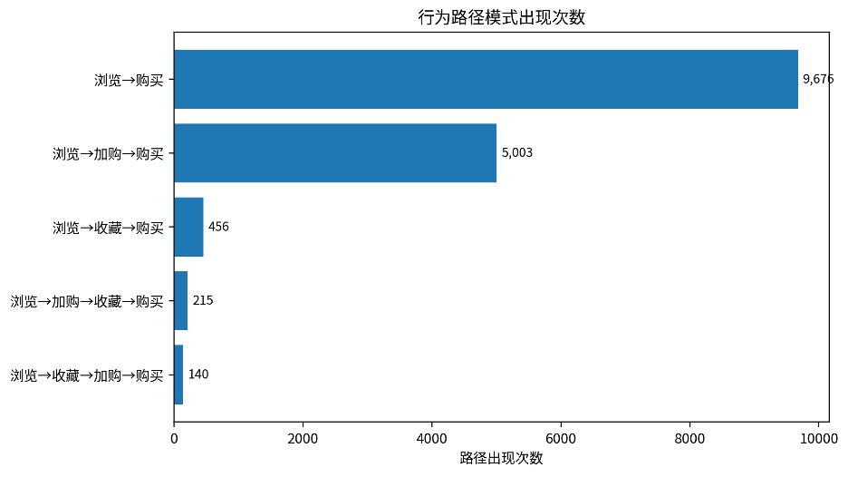
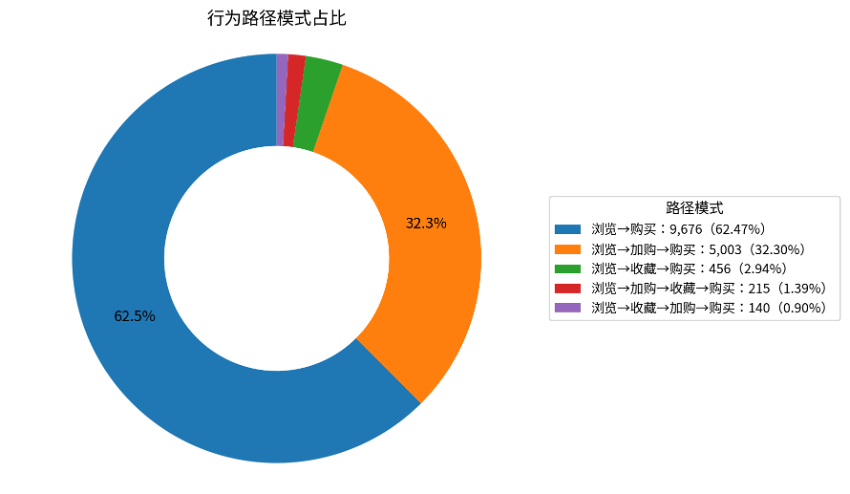
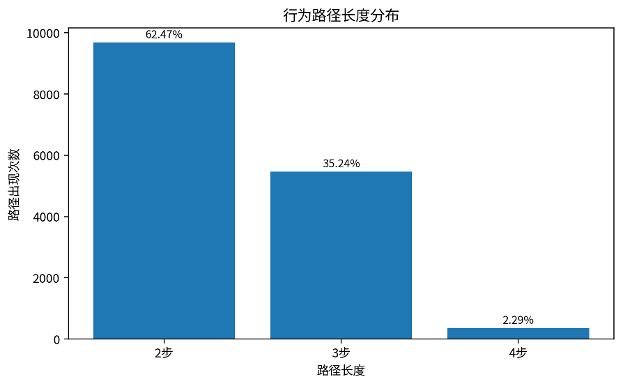
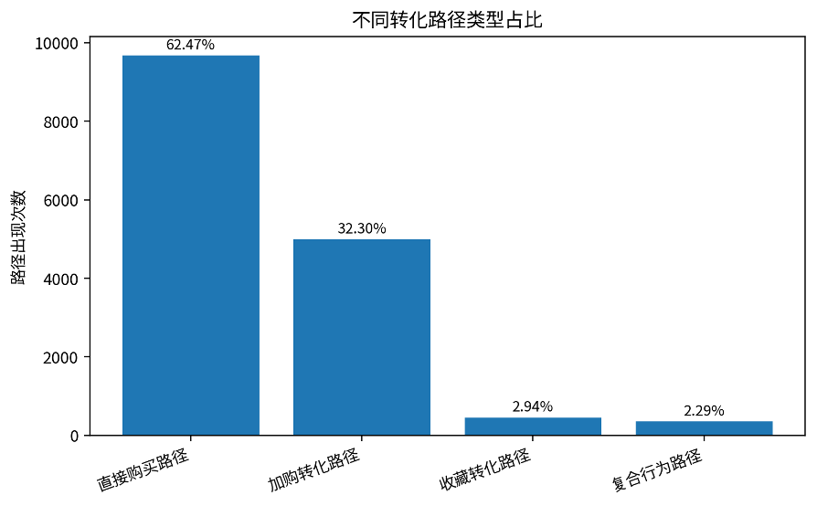

# **行为路径模式统计报告**

基于用户-商品维度的浏览、收藏、加购、购买路径模式分析

# 一、报告概述

路径统计以 user\_id + item\_id 为基本粒度，将用户对同一商品发生过的行为类型按首次发生时间排序，形成行为路径，并筛选以浏览开始、以购买结束的路径模式。

| **核心指标** | **结果**              |
| ------------------ | --------------------------- |
| 路径样本总数       | 15,490                      |
| 路径类型数         | 5 类                        |
| 第一大路径         | 浏览→购买（9,676，62.47%） |
| 前两大路径占比     | 94.76%                      |
| 直接购买路径占比   | 62.47%                      |
| 非直接购买路径占比 | 37.53%                      |
| 平均路径长度       | 2.40 步                     |

核心结论：

• “浏览→购买”路径出现 9,676 次，占比 62.47%，说明大量购买行为路径较短，用户在浏览后直接购买的比例较高。

• “浏览→加购→购买”路径出现 5,003 次，占比 32.30%，是第二大路径，说明加购是较强的购买意向信号。

• 前两大路径合计占比 94.76%，行为路径高度集中，主要转化链路较清晰。

• 包含收藏行为的路径合计占比仅 5.24%，说明收藏在购买路径中的参与度较低，可能更偏向兴趣沉淀而非即时购买触发。

# 二、指标口径与路径定义

行为路径模式用于描述用户在购买某个商品前经历过哪些关键行为。数据中的 behavior\_type 含义如下：

| **behavior\_type** | **行为含义** | **在路径中的作用**                 |
| ------------------------ | ------------------ | ---------------------------------------- |
| 1                        | 浏览               | 路径起点，代表用户产生商品曝光或访问     |
| 2                        | 收藏               | 兴趣沉淀行为，代表用户对商品产生长期关注 |
| 3                        | 加购               | 强购买意向行为，通常更接近成交           |
| 4                        | 购买               | 路径终点，代表完成转化                   |

本次 SQL 的主要统计逻辑为：先在 user\_id + item\_id + behavior\_type 维度取首次发生时间，再按照首次发生时间将行为类型拼接为路径。最终保留以浏览开始且以购买结束的路径，例如 1->4、1->3->4、1->2->3->4 等。

# 三、行为路径模式排名分析

从路径出现次数看，购买路径主要集中在少数几类模式中。其中“浏览→购买”是最主要路径，其次为“浏览→加购→购买”。这说明在购买场景中，用户要么直接完成购买，要么通过加购行为完成转化。

| **排名** | **原始路径** | **路径含义**     | **路径次数** | **路径占比** | **路径类型** |
| -------------- | ------------------ | ---------------------- | ------------------ | ------------------ | ------------------ |
| 1              | 1->4               | 浏览→购买             | 9,676              | 62.47%             | 直接购买路径       |
| 2              | 1->3->4            | 浏览→加购→购买       | 5,003              | 32.30%             | 加购转化路径       |
| 3              | 1->2->4            | 浏览→收藏→购买       | 456                | 2.94%              | 收藏转化路径       |
| 4              | 1->3->2->4         | 浏览→加购→收藏→购买 | 215                | 1.39%              | 复合行为路径       |
| 5              | 1->2->3->4         | 浏览→收藏→加购→购买 | 140                | 0.90%              | 复合行为路径       |

路径占比进一步表明，浏览后直接购买和浏览后加购再购买构成了主要转化通道。相较之下，收藏相关路径占比较小，说明收藏行为在本数据周期中不是最主要的成交前置行为。

# 四、路径长度与转化复杂度分析

| **路径长度** | **路径次数** | **占比** |
| ------------------ | ------------------ | -------------- |
| 2 步               | 9,676              | 62.47%         |
| 3 步               | 5,459              | 35.24%         |
| 4 步               | 355                | 2.29%          |

从路径长度看，2 步路径占比 62.47%，3 步路径占比 35.24%，4 步路径占比 2.29%。平均路径长度为 2.40 步，说明整体购买路径偏短，用户从浏览到购买的决策链路较直接。

# 五、路径类型结构分析

| **路径类型** | **路径次数** | **占比** |
| ------------------ | ------------------ | -------------- |
| 直接购买路径       | 9,676              | 62.47%         |
| 加购转化路径       | 5,003              | 32.30%         |
| 收藏转化路径       | 456                | 2.94%          |
| 复合行为路径       | 355                | 2.29%          |

直接购买路径占据主导，但加购转化路径同样具有较高占比。结合业务含义，加购行为可以作为购买预测、提醒触达、优惠券投放和购物车召回的重要信号。复合行为路径占比较低，说明“浏览→收藏→加购→购买”这类完整决策链路并不是主流路径。

# 六、业务解读与运营建议

1. 直接购买路径占比较高，说明部分商品或用户具有较强即时转化特征。对这类路径，可重点关注商品页转化效率、价格吸引力、库存保障和购买入口便捷性。
2. 加购路径是最重要的间接转化路径，说明购物车行为对成交具有明显推动作用。可以围绕加购未购用户设计提醒、限时优惠、满减券、库存紧张提示等策略。
3. 收藏相关路径占比较低，说明收藏更可能代表兴趣沉淀，而不是立即成交。对收藏用户可以采用更长周期的内容推荐、降价提醒和相似商品推荐。
4. 复合行为路径占比较小，但这类用户通常经历了更完整的决策过程，可视为高考虑型用户。对于高客单价或强比较型商品，复合路径仍具有分析价值。
