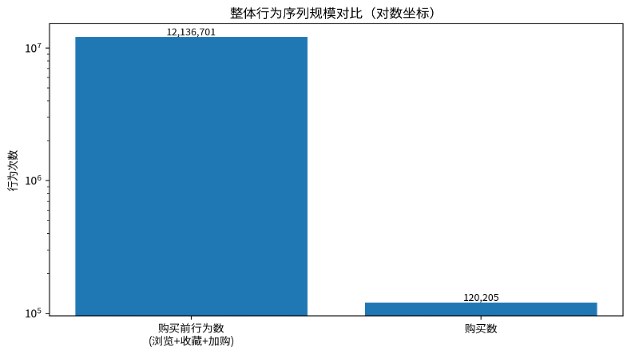
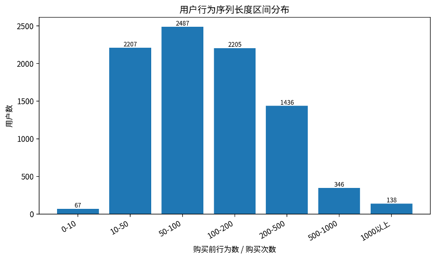
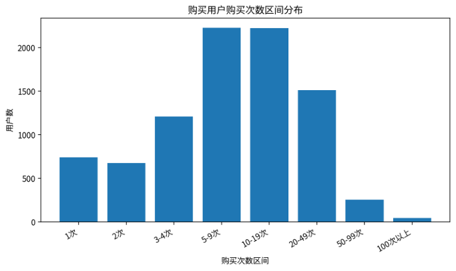
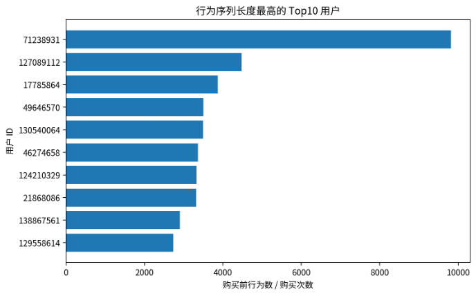

# **用户行为序列分析报告**

基于用户行为路径长度与整体行为序列长度结果表

| **核心指标**   | **结果**              |
| -------------------- | --------------------------- |
| 购买用户数           | 8,886 人                    |
| 整体购买前行为数     | 12,136,701 次               |
| 整体购买数           | 120,205 次                  |
| 整体行为序列长度     | 100.9667                    |
| 用户层面中位序列长度 | 91.4166                     |
| 随机抽检结果         | 随机抽检 100 人，返回值一致 |

# 一、指标定义与统计口径

本报告将浏览、收藏、加购三类行为定义为购买前行为，即 behavior\_type IN (1,2,3)；将购买行为定义为 behavior\_type = 4。

用户行为序列长度 = 用户购买前行为数 / 用户购买次数。该指标用于衡量用户在产生购买前平均经历多少次浏览、收藏或加购行为。

整体行为序列长度 = 全部购买前行为数 / 全部购买次数，用于反映平台整体从兴趣行为到购买行为之间的平均行为路径长度。

| **指标**   | **定义**                | **当前口径**                |
| ---------------- | ----------------------------- | --------------------------------- |
| 购买前行为数     | 浏览、收藏、加购行为数量合计  | SUM(behavior\_type IN (1,2,3))    |
| 购买数           | 用户或整体的购买行为数量      | SUM(behavior\_type = 4)           |
| 用户行为序列长度 | 购买前行为数 / 购买数         | pre\_buy\_behavior\_per\_purchase |
| 整体行为序列长度 | 全体购买前行为数 / 全体购买数 | 100.9667                          |

# 二、整体行为序列表现

整体结果表显示，全周期购买前行为数为 12,136,701 次，购买数为 120,205 次，整体行为序列长度为 100.9667。这意味着从整体上看，平均每产生 1 次购买，大约伴随 100.97 次浏览、收藏或加购行为。

在仅包含有购买行为用户的明细表中，购买前行为数合计为 11,638,825 次，购买数合计为 120,205 次，对应用户层面汇总口径的行为序列长度约为 96.8248。整体口径略高，是因为整体表中包含了未购买用户产生的购买前行为。

图1 整体购买前行为数与购买数规模对比

# 三、用户行为路径长度分布

用户级结果表共包含 8,886 名发生购买的用户。用户行为序列长度的均值为 162.9515，中位数为 91.4166，P75 为 177.8822，P90 为 344.9166，P95 为 527.0000，最大值达到 9815.0000。

从分布看，多数购买用户的行为序列长度集中在 10-200 之间，说明用户在购买前普遍存在一定程度的浏览、收藏或加购行为沉淀。少部分用户的序列长度超过 500，通常表现为行为很多但购买次数较少，可能属于强浏览弱购买、犹豫型或低转化效率用户。

| **统计量** | **行为序列长度** |
| ---------------- | ---------------------- |
| 最小值           | 2.0000                 |
| P10              | 28.2792                |
| P25              | 49.0000                |
| 中位数           | 91.4166                |
| P75              | 177.8822               |
| P90              | 344.9166               |
| P95              | 527.0000               |
| P99              | 1,170.15               |
| 最大值           | 9,815.00               |

图2 用户行为序列长度区间分布

| **序列长度区间** | **用户数** | **用户占比** |
| ---------------------- | ---------------- | ------------------ |
| 0-10                   | 67               | 0.75%              |
| 10-50                  | 2,207            | 24.84%             |
| 50-100                 | 2,487            | 27.99%             |
| 100-200                | 2,205            | 24.81%             |
| 200-500                | 1,436            | 16.16%             |
| 500-1000               | 346              | 3.89%              |
| 1000以上               | 138              | 1.55%              |

# 四、购买次数与行为序列长度关系

购买次数分布显示，购买用户主要集中在 5-19 次购买区间。其中 5-9 次购买用户占比约 25.06%，10-19 次购买用户占比约 25.03%。购买次数较高的用户通常行为序列长度相对较低，说明其购买决策路径更短，转化效率更稳定。

图3 购买用户购买次数区间分布

| **购买次数区间** | **用户数** | **用户占比** |
| ---------------------- | ---------------- | ------------------ |
| 1次                    | 738              | 8.31%              |
| 2次                    | 673              | 7.57%              |
| 3-4次                  | 1,209            | 13.61%             |
| 5-9次                  | 2,227            | 25.06%             |
| 10-19次                | 2,224            | 25.03%             |
| 20-49次                | 1,513            | 17.03%             |
| 50-99次                | 257              | 2.89%              |
| 100次以上              | 45               | 0.51%              |

# 五、高行为序列用户分析

行为序列长度最高的用户多为购买次数较少但购买前行为很多的用户。例如 Top10 用户中，多数仅购买 1-2 次，但购买前行为数达到数千次，因此形成极高的行为序列长度。这类用户可能对商品存在较长比较周期，或者存在大量浏览但实际购买意愿不足的情况。

图4 行为序列长度最高的 Top10 用户

| **用户ID** | **购买前行为数** | **购买数** | **行为序列长度** |
| ---------------- | ---------------------- | ---------------- | ---------------------- |
| 71238931         | 9,815                  | 1                | 9,815.00               |
| 127089112        | 4,477                  | 1                | 4,477.00               |
| 17785864         | 3,872                  | 1                | 3,872.00               |
| 49646570         | 3,499                  | 1                | 3,499.00               |
| 130540064        | 6,991                  | 2                | 3,495.50               |
| 46274658         | 3,364                  | 1                | 3,364.00               |
| 124210329        | 3,326                  | 1                | 3,326.00               |
| 21868086         | 6,634                  | 2                | 3,317.00               |
| 138867561        | 5,799                  | 2                | 2,899.50               |
| 129558614        | 2,731                  | 1                | 2,731.00               |

# 六、业务含义与运营建议

• 整体行为序列长度较高，说明购买行为之前存在大量浏览、收藏和加购动作，平台用户购买决策链路较长。

• 中位数低于均值，且 P95、P99 明显偏高，说明用户行为序列长度存在长尾分布，少数用户显著拉高平均水平。

• 高行为序列但低购买次数用户可作为犹豫型用户或低转化效率用户识别对象，适合通过优惠提醒、库存提醒、相似商品推荐等方式促进转化。

# 七、抽样验证说明

为验证用户行为序列长度统计结果的准确性，本文从用户行为路径长度结果表中随机抽取 100 名用户，并回到原始行为明细表 data\_min 中重新统计每位用户的购买前行为数、购买数和行为序列长度。抽检结果返回值均一致，说明用户行为序列长度统计逻辑可靠。
