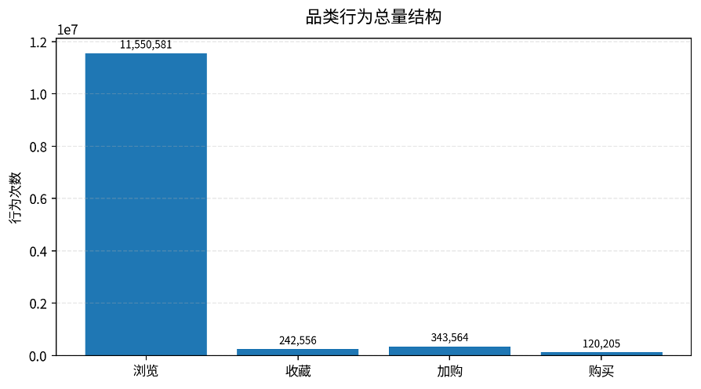
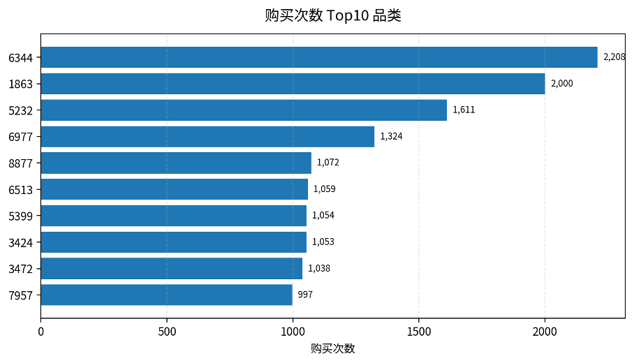
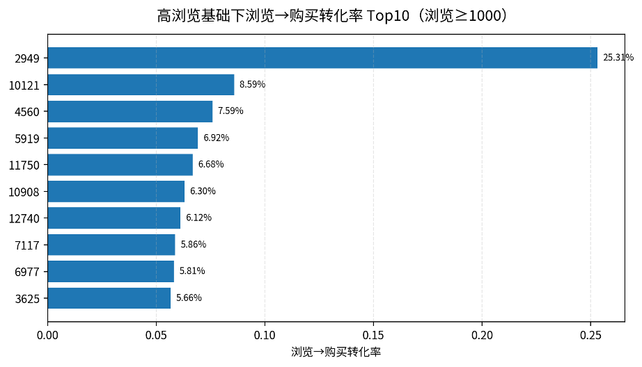
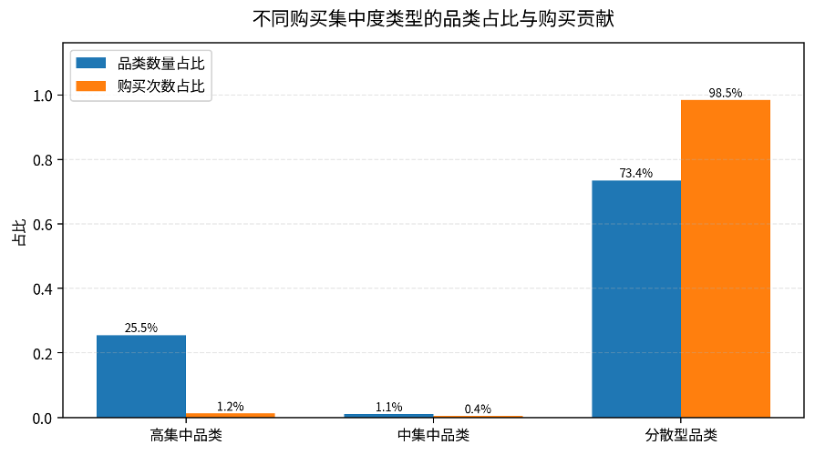
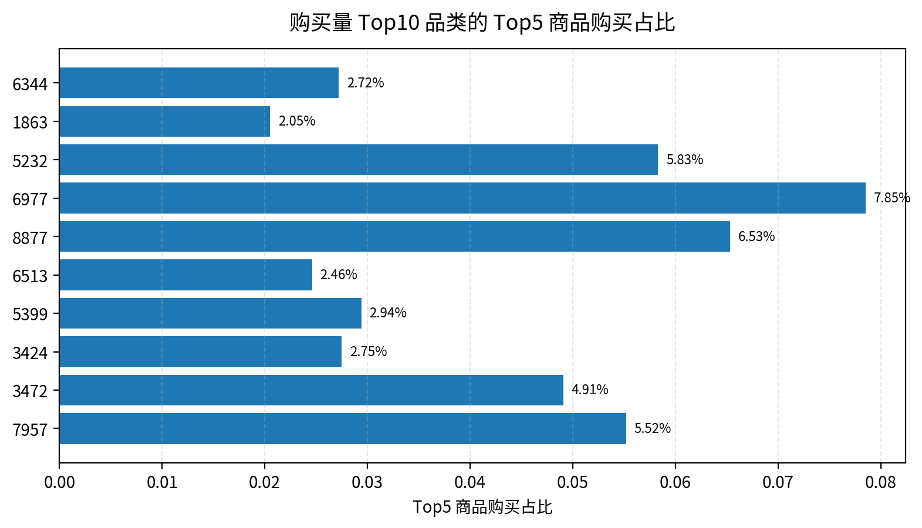
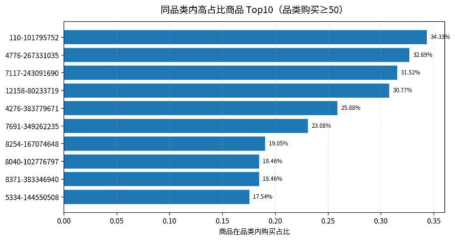
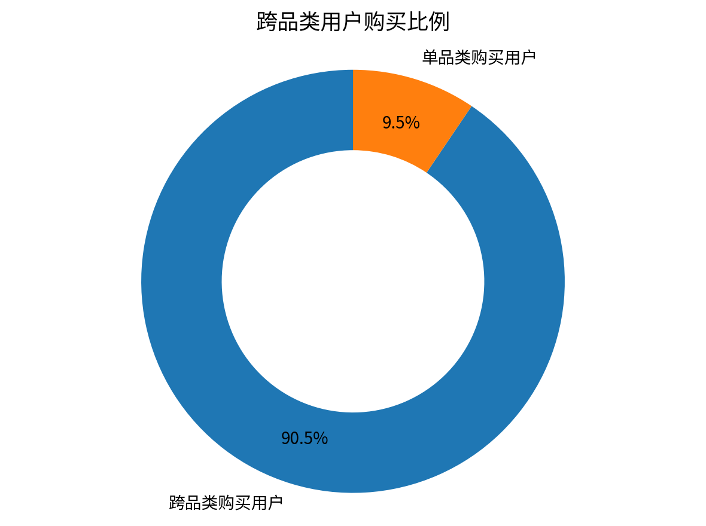
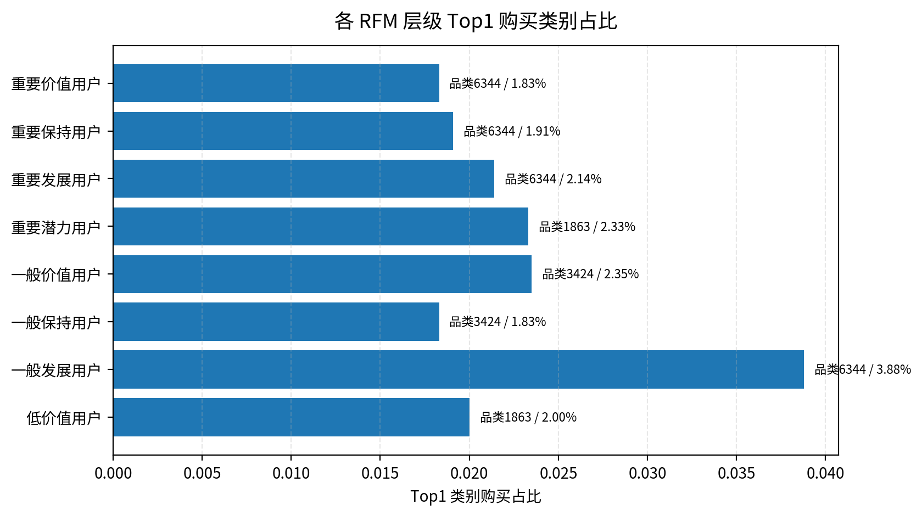
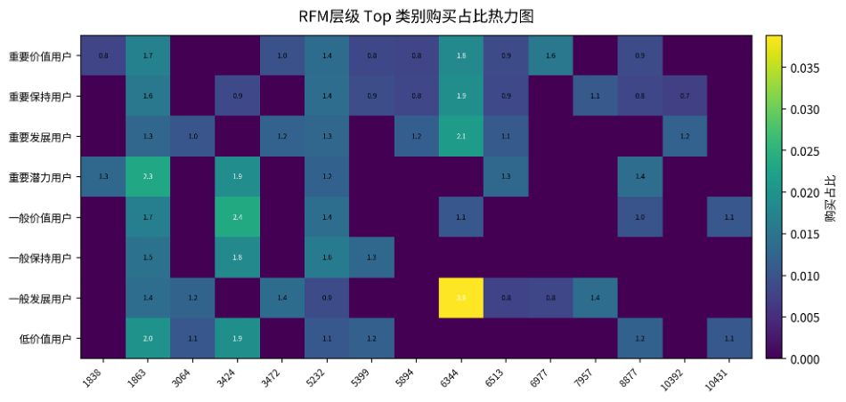

# 品类表现分析报告

基于品类转化率、购买集中度、品类内商品竞争、跨品类购买与RFM层次偏好

# 一、核心结论

* 本次品类转化率表覆盖 8,916 个品类，整体浏览量 11,550,581 次、购买量 120,205 次，整体浏览→购买转化率为 1.04%。
* 购买过的品类共有 4,665 个，其中分散型品类 3,426 个；从购买贡献看，分散型品类贡献了 98.47% 的购买次数，说明主力品类并非由少数商品垄断，而是多商品共同贡献。
* 跨品类购买用户为 8,045 人，占总购买用户 8,886 人的 90.54%，说明购买用户具有较强多品类购买特征，具备交叉推荐和组合运营空间。
* RFM层次偏好显示，重要价值用户、重要保持用户和重要发展用户的Top1购买类别均为6344，说明该品类对高价值用户层级具有较强吸引力，应作为核心运营品类重点维护。

# 二、数据来源与指标口径

本报告基于用户行为明细表 data\_min 派生出的多张结果表进行分析。行为类型口径为：1=浏览、2=收藏、3=加购、4=购买。品类层面的购买相关指标均以 behavior\_type=4 作为统计口径。

| **指标**       | **结果** |
| -------------------- | -------------- |
| 品类转化率覆盖品类数 | 8,916          |
| 有购买行为品类数     | 4,665          |
| 商品-品类购买组合数  | 92,753         |
| 总浏览次数           | 11,550,581     |
| 总收藏次数           | 242,556        |
| 总加购次数           | 343,564        |
| 总购买次数           | 120,205        |
| 整体浏览→收藏率     | 2.10%          |
| 整体加购→购买率     | 34.99%         |
| 整体浏览→购买率     | 1.04%          |
| 跨品类购买用户比例   | 90.54%         |

# 三、品类转化率表现

品类转化率用于观察不同商品类别在浏览、收藏、加购、购买链路中的行为承接能力。

*图1 品类行为总量结构*

*图2 购买次数 Top10 品类*

| **品类ID** | **浏览** | **收藏** | **加购** | **购买** | **浏览→购买** |
| ---------------- | -------------- | -------------- | -------------- | -------------- | -------------------- |
| 6,344            | 85,369         | 1,660          | 3,822          | 2,208          | 2.59%                |
| 1,863            | 371,738        | 10,200         | 9,309          | 2,000          | 0.54%                |
| 5,232            | 135,506        | 2,597          | 4,486          | 1,611          | 1.19%                |
| 6,977            | 22,806         | 273            | 2,007          | 1,324          | 5.81%                |
| 8,877            | 63,396         | 1,247          | 1,974          | 1,072          | 1.69%                |
| 6,513            | 281,370        | 6,688          | 6,651          | 1,059          | 0.38%                |
| 5,399            | 268,639        | 6,616          | 5,430          | 1,054          | 0.39%                |
| 3,424            | 51,001         | 773            | 1,498          | 1,053          | 2.06%                |
| 3,472            | 51,456         | 823            | 1,707          | 1,038          | 2.02%                |
| 7,957            | 42,555         | 883            | 2,745          | 997            | 2.34%                |

从购买规模看，品类6344、1863、5232、6977、8877位于购买次数前列。其中，品类6344购买次数最高，且浏览→购买率达到2.59%，表现出较强交易承接能力；品类6977的浏览→购买率达到5.81%，在Top购买品类中转化效率相对突出。

*图3 高浏览基础下浏览→购买转化率 Top10*

| **品类ID** | **浏览** | **购买** | **浏览→购买** | **加购→购买** |
| ---------------- | -------------- | -------------- | -------------------- | -------------------- |
| 2,949            | 1,474          | 373            | 25.31%               | 956.41%              |
| 10,121           | 3,110          | 267            | 8.59%                | nan                  |
| 4,560            | 2,108          | 160            | 7.59%                | 59.93%               |
| 5,919            | 1,011          | 70             | 6.92%                | nan                  |
| 11,750           | 1,991          | 133            | 6.68%                | 82.10%               |
| 10,908           | 1,333          | 84             | 6.30%                | 84.00%               |
| 12,740           | 1,291          | 79             | 6.12%                | 79.00%               |
| 7,117            | 1,570          | 92             | 5.86%                | 103.37%              |
| 6,977            | 22,806         | 1,324          | 5.81%                | 65.97%               |
| 3,625            | 2,913          | 165            | 5.66%                | 71.12%               |

# 四、品类购买集中度分析

品类购买集中度用于衡量一个品类内部的购买行为是否集中在少数商品上。本报告使用品类内各商品购买占比平方和（HHI）及标准化HHI衡量集中程度。标准化HHI越接近1，说明品类购买越集中；越接近0，说明品类购买越分散。

*图4 不同购买集中度类型的品类数量占比与购买贡献*

| **集中度类型** | **品类数** | **品类数占比** | **购买次数** | **购买贡献占比** | **平均标准化HHI** | **平均Top1占比** | **平均Top5占比** |
| -------------------- | ---------------- | -------------------- | ------------------ | ---------------------- | ----------------------- | ---------------------- | ---------------------- |
| 高集中品类           | 1,190            | 25.51%               | 1,417              | 1.18%                  | 0.9975                  | 99.92%                 | 100.00%                |
| 中集中品类           | 49               | 1.05%                | 425                | 0.35%                  | 0.2937                  | 70.02%                 | 98.19%                 |
| 分散型品类           | 3,426            | 73.44%               | 118,363            | 98.47%                 | 0.0141                  | 24.80%                 | 68.10%                 |

从品类数量看，高集中品类数量较多，但其购买贡献较低，主要是因为许多低购买量品类只有少数商品产生购买，导致标准化HHI偏高。与之相反，购买规模最大的主力品类普遍呈现分散型结构，说明核心购买量来自大量商品共同贡献，而非单一爆款。

*图5 购买量 Top10 品类的 Top5 商品购买占比*

| **品类ID** | **品类购买次数** | **购买商品数** | **Top1商品ID** | **Top1占比** | **Top5占比** | **标准化HHI** | **类型** |
| ---------------- | ---------------------- | -------------------- | -------------------- | ------------------ | ------------------ | ------------------- | -------------- |
| 6,344            | 2,208                  | 1,246                | 254,228,319          | 0.68%              | 2.72%              | 0.0006              | 分散型品类     |
| 1,863            | 2,000                  | 1,674                | 109,800,338          | 0.55%              | 2.05%              | 0.0002              | 分散型品类     |
| 5,232            | 1,611                  | 1,004                | 14,087,919           | 2.17%              | 5.83%              | 0.0012              | 分散型品类     |
| 6,977            | 1,324                  | 633                  | 109,259,240          | 1.81%              | 7.85%              | 0.0025              | 分散型品类     |
| 8,877            | 1,072                  | 714                  | 17,065,447           | 2.05%              | 6.53%              | 0.0014              | 分散型品类     |
| 6,513            | 1,059                  | 915                  | 19,328,422           | 0.66%              | 2.46%              | 0.0002              | 分散型品类     |
| 5,399            | 1,054                  | 896                  | 160,245,518          | 0.95%              | 2.94%              | 0.0002              | 分散型品类     |
| 3,424            | 1,053                  | 858                  | 125,040,457          | 0.95%              | 2.75%              | 0.0003              | 分散型品类     |
| 3,472            | 1,038                  | 588                  | 23,687,127           | 1.06%              | 4.91%              | 0.0014              | 分散型品类     |
| 7,957            | 997                    | 682                  | 331,245,551          | 1.40%              | 5.52%              | 0.0011              | 分散型品类     |

# 五、同品类商品竞争表现

同品类商品竞争度反映单个商品在其所属品类购买量中的占比。占比越高，说明该商品在该品类内越接近头部商品；占比越低，说明购买更分散，品类内部竞争更充分。

*图6 同品类内高占比商品 Top10（限定品类购买次数≥50）*

| **品类ID** | **商品ID** | **商品购买次数** | **品类购买次数** | **商品品类内占比** |
| ---------------- | ---------------- | ---------------------- | ---------------------- | ------------------------ |
| 110              | 101,795,752      | 23                     | 67                     | 34.33%                   |
| 4,776            | 267,331,035      | 17                     | 52                     | 32.69%                   |
| 7,117            | 243,091,690      | 29                     | 92                     | 31.52%                   |
| 12,158           | 80,233,719       | 16                     | 52                     | 30.77%                   |
| 4,276            | 383,779,671      | 22                     | 85                     | 25.88%                   |
| 7,691            | 349,262,235      | 15                     | 65                     | 23.08%                   |
| 8,254            | 167,074,648      | 28                     | 147                    | 19.05%                   |
| 8,040            | 102,776,797      | 12                     | 65                     | 18.46%                   |
| 8,371            | 383,346,940      | 12                     | 65                     | 18.46%                   |
| 5,334            | 144,550,508      | 10                     | 57                     | 17.54%                   |

从高占比商品看，部分类别存在明显头部商品，例如品类110中的商品101795752占该品类购买次数的34.33%。这类商品适合作为该品类的重点维护对象；而购买规模较大的主力品类中，Top1或Top5占比通常较低，更适合采用多商品矩阵运营。

# 六、跨品类购买行为

跨品类用户购买比例用于衡量购买用户是否具备多品类购买行为。若用户在统计周期内购买过两个及以上商品品类，则定义为跨品类购买用户；若仅购买过一个品类，则定义为单品类购买用户。

*图7 跨品类购买用户占比*

| **指标**     | **结果** |
| ------------------ | -------------- |
| 总购买用户数       | 8,886          |
| 单品类购买用户数   | 841            |
| 跨品类购买用户数   | 8,045          |
| 跨品类用户购买比例 | 90.54%         |

结果显示，跨品类购买用户占比达到90.54%，说明大多数购买用户并不局限于单一品类，具备跨品类复购和组合购买潜力。后续可以围绕高购买品类6344、1863、5232等构建组合推荐路径。

# 七、RFM用户层次购买偏好

RFM用户层次购买偏好用于识别不同价值层级用户最偏好的商品类别。本文按照RFM用户层级分组，统计每个层级中购买次数最多的Top10品类，并重点展示各层级Top1类别及其购买占比。

*图8 各RFM层级Top1购买类别占比*

*图9 RFM层级Top类别购买占比热力图*

| **RFM层级** | **Top1品类** | **购买次数** | **购买用户数** | **层级总购买次数** | **层级内购买占比** | **层级内用户覆盖率** |
| ----------------- | ------------------ | ------------------ | -------------------- | ------------------------ | ------------------------ | -------------------------- |
| 一般价值用户      | 3,424              | 42                 | 35                   | 1,787                    | 2.35%                    | 6.23%                      |
| 一般保持用户      | 3,424              | 35                 | 26                   | 1,917                    | 1.83%                    | 6.95%                      |
| 一般发展用户      | 6,344              | 193                | 47                   | 4,977                    | 3.88%                    | 10.44%                     |
| 低价值用户        | 1,863              | 131                | 119                  | 6,535                    | 2.00%                    | 4.96%                      |
| 重要价值用户      | 6,344              | 1,227              | 435                  | 66,947                   | 1.83%                    | 16.53%                     |
| 重要保持用户      | 6,344              | 672                | 261                  | 35,248                   | 1.91%                    | 12.39%                     |
| 重要发展用户      | 6,344              | 35                 | 18                   | 1,637                    | 2.14%                    | 12.59%                     |
| 重要潜力用户      | 1,863              | 27                 | 24                   | 1,157                    | 2.33%                    | 10.96%                     |

从RFM结果看，重要价值用户、重要保持用户、重要发展用户的Top1购买类别均为6344，说明品类6344不仅总购买量高，也能有效覆盖高价值用户层级；低价值用户和重要潜力用户Top1类别为1863，说明该品类覆盖面较广，可作为潜力用户转化和低价值用户激活的入口。

# 八、抽样验证说明

| **验证对象**     | **抽检方式**         | **验证结果**                                                                 | **结论**                       |
| ---------------------- | -------------------------- | ---------------------------------------------------------------------------------- | ------------------------------------ |
| 品类转化率             | 随机抽检100组品类          | 行为数量统计结果一致；部分转化率字段因百分比字符串与小数计算口径不同出现表面不一致 | 格式与精度差异，不影响行为统计准确性 |
| 商品所属品类购买集中度 | 随机抽检100组品类          | 返回值均一致                                                                       | 统计逻辑可靠                         |
| 商品品类内购买占比     | 随机抽检100个商品-品类组合 | 商品购买次数、品类购买次数和购买占比均一致                                         | 统计逻辑可靠                         |

在品类转化率随机抽检100组中，部分样本出现转化率字段不一致。进一步检查发现，行为数量统计结果一致，差异主要来源于转化率字段的展示格式差异，即结果表中使用百分比字符串形式，而回溯验证中使用小数形式计算。因此该差异属于格式和精度问题，不影响行为统计结果的准确性。

商品所属品类购买集中度随机抽检100组，返回值皆一致。商品品类内购买占比通过随机抽取100个商品-品类组合回到原始行为明细表data\_min重新统计，商品购买次数、品类购买次数和购买占比均一致，说明该指标统计逻辑可靠。

# 九、运营建议

* 重点运营购买规模大且高价值用户偏好的品类，例如6344、1863、5232等，将其作为商品推荐、活动资源和核心用户维护的优先对象。
* 对购买规模大但集中度低的分散型品类，应采用多商品矩阵策略，而不是只维护单一爆款；可围绕Top5商品进行流量分配和搭配推荐。
* 对高集中但购买量小的品类，应区分是真实爆款依赖还是样本量偏小导致的高集中；若品类购买次数较少，不宜仅凭高HHI判断其为稳定爆款。
* 跨品类购买用户占比较高，说明用户具备多品类扩展潜力，可基于RFM层级和品类偏好设计组合券、关联推荐和跨品类召回策略。
