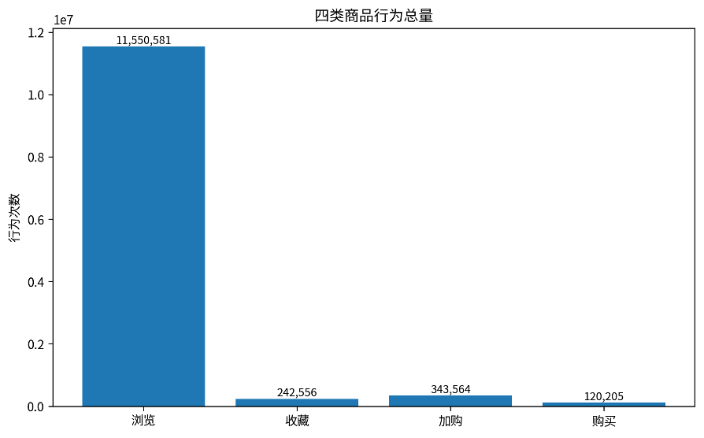
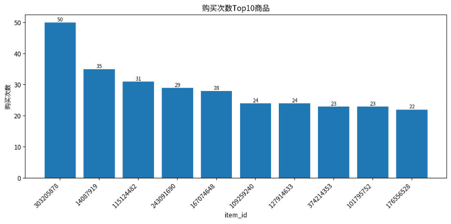
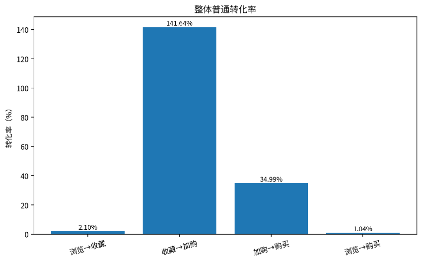
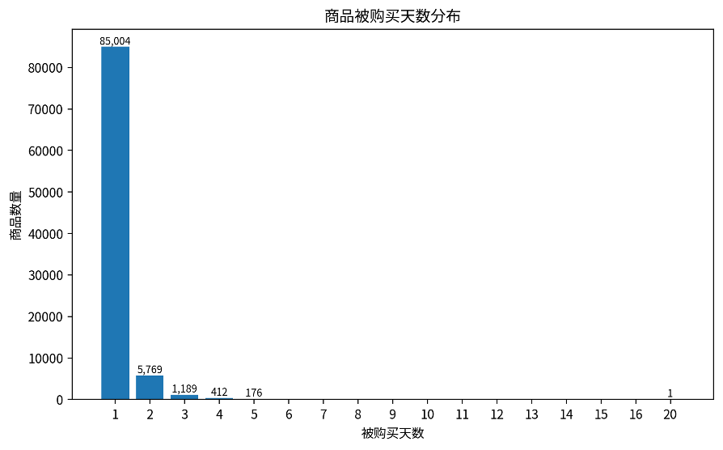
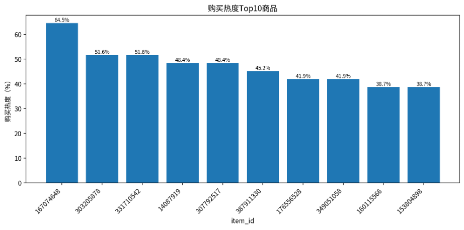

# **商品行为分析报告**

基于商品行为数、商品普通转化率与商品购买热度结果表

# 一、分析口径与数据说明

本报告基于更新后的三张商品维度结果表展开分析：商品行为数表、商品转化率表和商品热度表。商品行为数表统计每个商品在所属品类下的浏览、收藏、加购和购买次数；商品转化率表在行为数基础上计算普通行为转化率；商品热度表统计商品在调查期内发生购买的天数、购买次数和购买热度。

抽样验证说明：本次更新后，商品行为数、商品转化率和商品热度结果均采用“随机抽取100个商品回原始表检查”的方式进行抽检，返回结果全部一致，说明三类商品结果表的统计逻辑可靠。

| **指标**              | **数值** |
| --------------------------- | -------------- |
| 商品-品类组合数             | 2,876,947      |
| 商品品类数                  | 8,916          |
| 有购买记录的商品-品类组合数 | 92,753         |
| 总行为次数                  | 12,256,906     |
| 总浏览次数                  | 11,550,581     |
| 总收藏次数                  | 242,556        |
| 总加购次数                  | 343,564        |
| 总购买次数                  | 120,205        |

# 二、商品行为数分析

从整体行为结构看，浏览行为为 11,550,581 次，占全部商品行为的 94.24%，是商品行为链路中的绝对主体。收藏和加购分别为 242,556 次和 343,564 次，购买行为为 120,205 次。该结果说明用户在浏览阶段产生了大量行为，但最终进入购买阶段的行为占比相对较低，商品行为链路存在明显的前端流量大、后端购买少的特征。

图1 四类商品行为总量

# 三、购买次数Top商品

购买次数较高的商品可以反映出更强的交易吸引力。下表列出了购买次数排名靠前的商品，这些商品不仅可作为重点商品观察对象，也可用于进一步分析其所属品类、浏览量、加购量与购买表现之间的关系。

| **品类** | **商品ID** | **浏览** | **收藏** | **加购** | **购买** |
| -------------- | ---------------- | -------------- | -------------- | -------------- | -------------- |
| 13500          | 303205878        | 534            | 11             | 46             | 50             |
| 5232           | 14087919         | 740            | 15             | 33             | 35             |
| 5027           | 115124482        | 20             | 0              | 0              | 31             |
| 7117           | 243091690        | 54             | 2              | 3              | 29             |
| 8254           | 167074648        | 429            | 4              | 19             | 28             |
| 6977           | 109259240        | 119            | 0              | 14             | 24             |
| 10392          | 127914633        | 29             | 0              | 4              | 24             |
| 11497          | 374214353        | 320            | 2              | 32             | 23             |
| 110            | 101795752        | 49             | 0              | 4              | 23             |
| 7606           | 176556528        | 196            | 3              | 11             | 22             |

图2 购买次数Top10商品

# 四、商品普通转化率分析

| **转化率指标** | **整体结果** |
| -------------------- | ------------------ |
| 浏览→收藏转化率     | 2.10%              |
| 收藏→加购转化率     | 141.64%            |
| 加购→购买转化率     | 34.99%             |
| 浏览→购买转化率     | 1.04%              |

整体浏览到购买转化率为 1.04%，说明每100次浏览大约对应 1.04 次购买。加购到购买转化率为 34.99%，明显高于浏览到购买转化率，说明加购行为对后续购买具有更强的指示意义。

图3 整体普通转化率

# 五、商品购买热度分析

商品购买热度定义为商品在调查期内发生购买的天数除以总调查天数。本次调查期按31天计算。共有 92,753 个商品-品类组合发生过购买行为，平均被购买天数为 1.12 天，中位数为 1 天，最高购买天数为 20 天。

从分布看，91.65% 的已购买商品只在1天内发生过购买，83.65% 的已购买商品仅被购买1次。这说明大部分商品购买持续性较弱，购买行为集中在少数时间点；而少数高热度商品具有更稳定的持续购买能力。

图4 商品被购买天数分布

| **品类** | **商品ID** | **购买天数** | **购买次数** | **调查天数** | **购买热度** |
| -------------- | ---------------- | ------------------ | ------------------ | ------------------ | ------------------ |
| 8254           | 167074648        | 20                 | 28                 | 31                 | 64.52%             |
| 13500          | 303205878        | 16                 | 50                 | 31                 | 51.61%             |
| 8796           | 331710542        | 16                 | 21                 | 31                 | 51.61%             |
| 5232           | 14087919         | 15                 | 35                 | 31                 | 48.39%             |
| 8792           | 307792517        | 15                 | 17                 | 31                 | 48.39%             |
| 6000           | 387911330        | 14                 | 19                 | 31                 | 45.16%             |
| 7606           | 176556528        | 13                 | 22                 | 31                 | 41.94%             |
| 12304          | 349051058        | 13                 | 14                 | 31                 | 41.94%             |
| 8877           | 160115566        | 12                 | 18                 | 31                 | 38.71%             |
| 7606           | 153804898        | 12                 | 16                 | 31                 | 38.71%             |

图5 购买热度Top10商品

# 六、抽样验证与可靠性说明

本次更新后，商品行为数表、商品转化率表和商品热度表均采用随机抽样方式进行回溯验证。具体做法为：从各结果表中随机抽取100个商品-品类组合，回到原始行为明细表重新统计对应商品的浏览、收藏、加购、购买、购买天数和购买热度等指标，并与结果表进行对比。抽检返回结果全部一致，说明结果表统计逻辑与原始数据一致，具有较好的可靠性。

# 七、结论与建议

• 商品行为以浏览为主，购买行为占比较低，说明商品链路前端流量充足，但最终购买转化仍有提升空间。

• 加购到购买转化率明显高于浏览到购买转化率，后续运营可重点关注加购用户和高加购商品，通过提醒、优惠券、库存提示等方式推动成交。

• 多数商品购买持续性较弱，大量商品只在1天内发生过购买。建议将商品区分为短期偶发购买商品和持续热销商品，分别采取不同运营策略。

• 购买次数Top商品和购买热度Top商品应作为重点商品池，进一步分析其品类特征、曝光位置和用户来源，用于优化商品推荐和资源分配。

# 附录：核心计算口径

| **模块** | **计算口径**                                                             |
| -------------- | ------------------------------------------------------------------------------ |
| 商品行为数     | 按 item\_category、item\_id 分组，分别统计 behavior\_type=1/2/3/4 的行为次数。 |
| 普通转化率     | 基于商品行为数表计算：收藏/浏览、加购/收藏、购买/加购、购买/浏览。             |
| 商品购买热度   | 按商品统计发生购买的不同日期数，并除以调查期31天。                             |
| 抽样验证       | 随机抽取100个商品-品类组合，回原始表重算并逐项对比。                           |
