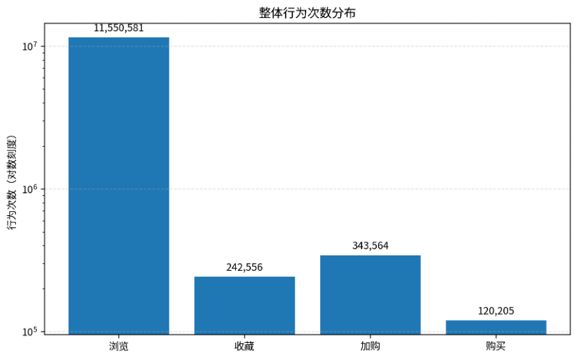
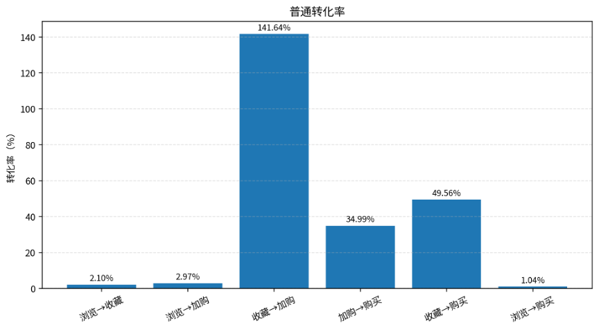

# **商品整体行为分析报告**

基于浏览、收藏、加购、购买四类行为的整体结构与转化分析

# 一、分析口径

本报告基于商品整体行为汇总表进行分析，行为类型包括浏览、收藏、加购和购买。统计口径为全量行为次数加总，不区分用户、商品或日期。

其中 behavior\_type = 1 表示浏览，behavior\_type = 2 表示收藏，behavior\_type = 3 表示加购，behavior\_type = 4 表示购买。整体转化率采用普通行为量转化口径，即用后一阶段行为次数除以前一阶段或浏览行为次数。

# 二、整体行为规模

| **行为类型** | **字段**  | **行为次数** | **占总行为比例** |
| ------------------ | --------------- | ------------------ | ---------------------- |
| 浏览               | total\_views    | 11,550,581         | 94.24%                 |
| 收藏               | total\_fav      | 242,556            | 1.98%                  |
| 加购               | total\_cart     | 343,564            | 2.80%                  |
| 购买               | total\_sales    | 120,205            | 0.98%                  |
| 总行为             | total\_behavior | 12,256,906         | 100.00%                |

整体来看，样本期内共记录 12,256,906 次行为，其中浏览行为 11,550,581 次，占比 94.24%，说明用户行为主要集中在商品浏览阶段。购买行为共 120,205 次，占整体行为的 0.98%。

图1 整体行为次数分布

# 三、普通转化率分析

| **转化指标** | **计算公式** | **结果** |
| ------------------ | ------------------ | -------------- |
| 浏览→收藏         | 收藏数 / 浏览数    | 2.10%          |
| 浏览→加购         | 加购数 / 浏览数    | 2.97%          |
| 收藏→加购         | 加购数 / 收藏数    | 141.64%        |
| 加购→购买         | 购买数 / 加购数    | 34.99%         |
| 收藏→购买         | 购买数 / 收藏数    | 49.56%         |
| 浏览→购买         | 购买数 / 浏览数    | 1.04%          |

从普通转化率看，浏览到收藏转化率为 2.10%，浏览到加购转化率为 2.97%，浏览到购买总转化率为 1.04%。这说明从浏览进入更高意向行为的比例较低，浏览环节仍是主要流失位置。

加购到购买转化率为 34.99%，明显高于浏览到购买转化率，说明一旦用户进入加购环节，购买意愿已经较强。

图2 普通行为转化率

# 四、核心结论

• 浏览行为占比高达 94.24%，平台或商品流量基础较大，但后续收藏、加购和购买行为占比相对较低。

• 浏览到购买转化率仅为 1.04%，说明整体购买转化链路仍存在较大提升空间。

• 加购到购买转化率为 34.99%，说明加购用户具备较强购买倾向，适合重点开展加购召回、优惠提醒和限时促销策略。

• 加购次数高于收藏次数，说明部分用户可能更倾向于直接加购而不是收藏。

# 五、运营建议

• 针对浏览后未加购用户，可通过商品详情页优化、评价展示、价格提示和关联推荐提高浏览向意向行为的转化。

• 针对加购未购买用户，可设置购物车提醒、限时优惠、降价提醒等策略，因为该群体距离购买最近，转化潜力较高。

• 针对收藏用户，可通过收藏商品动态提醒、同品类推荐和促销信息触达，推动收藏向加购或购买转化。

• 后续可以进一步拆分到品类、商品、用户和时间维度，识别高流量低转化商品、高加购高成交商品，以及大促节点对转化率的影响。
