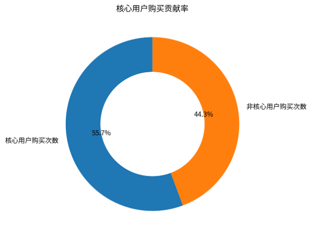
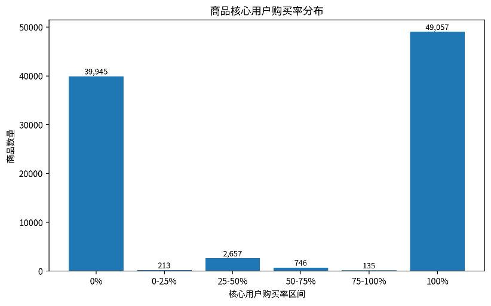
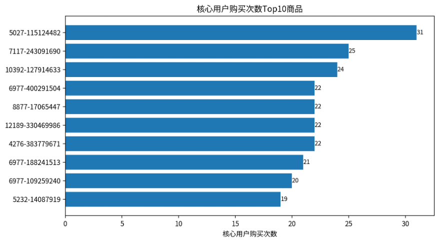
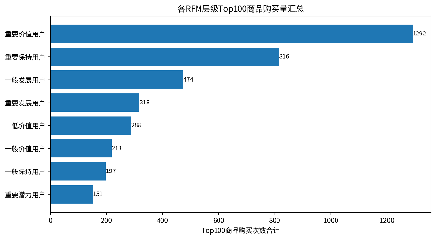
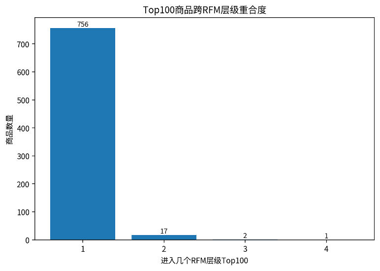

# **商品与用户交叉分析报告**

基于核心用户购买贡献、商品核心用户购买率与RFM用户层级Top商品偏好

# 一、分析目标与数据口径

本报告从“商品 × 用户层级”的角度分析商品购买结构，重点识别哪些购买行为由核心用户贡献、哪些商品更依赖核心用户，以及不同RFM用户层级各自偏好的Top商品。

核心用户定义：将RFM分层中的“重要价值用户”定义为核心用户。

核心用户购买贡献率：核心用户产生的购买次数 / 全体购买次数。

商品核心用户购买率：某商品由核心用户产生的购买次数 / 该商品总购买次数。

RFM层级Top100商品：在每个RFM用户层级内部，按商品购买次数降序排序，取前100个商品。

# 二、核心用户总体购买贡献

| **指标**     | **结果** |
| ------------------ | -------------- |
| 核心用户类型       | 重要价值用户   |
| 核心用户人数       | 2,631          |
| 全体购买次数       | 120,205        |
| 核心用户购买次数   | 66,947         |
| 核心用户购买贡献率 | 55.69%         |
| 非核心用户购买次数 | 53,258         |

结果显示，核心用户共 2,631 人，贡献购买次数 66,947 次，占全部购买次数 120,205 次的 55.69%。这说明平台购买行为对核心用户存在较强依赖，核心用户虽然只是用户分层中的一类，但对整体成交贡献明显。

# 三、商品核心用户购买率分析

核心用户购买率为100%的商品有 49,057 个，核心用户购买率为0%的商品有 39,945 个；核心用户购买率不低于50%的商品有 52,004 个。这说明商品之间对核心用户的依赖程度差异明显，部分商品主要由高价值用户购买，而另一些商品更多依赖非核心用户。

# 四、核心用户购买贡献Top商品

下表展示核心用户购买次数最高的商品。该类商品既有较强的核心用户购买基础，也具备作为高价值用户维护和定向推荐商品的潜力。

| **品类ID** | **商品ID** | **总购买次数** | **核心用户购买次数** | **非核心用户购买次数** | **核心用户购买率** |
| ---------------- | ---------------- | -------------------- | -------------------------- | ---------------------------- | ------------------------ |
| 5,027            | 115,124,482      | 31                   | 31                         | 0                            | 1.00                     |
| 7,117            | 243,091,690      | 29                   | 25                         | 4                            | 0.8621                   |
| 10,392           | 127,914,633      | 24                   | 24                         | 0                            | 1.00                     |
| 4,276            | 383,779,671      | 22                   | 22                         | 0                            | 1.00                     |
| 6,977            | 400,291,504      | 22                   | 22                         | 0                            | 1.00                     |
| 8,877            | 17,065,447       | 22                   | 22                         | 0                            | 1.00                     |
| 12,189           | 330,469,986      | 22                   | 22                         | 0                            | 1.00                     |
| 6,977            | 188,241,513      | 21                   | 21                         | 0                            | 1.00                     |
| 6,977            | 109,259,240      | 24                   | 20                         | 4                            | 0.8333                   |
| 5,232            | 14,087,919       | 35                   | 19                         | 16                           | 0.5429                   |

# 五、RFM用户层级商品购买偏好

RFM各层级Top100商品表用于比较不同用户价值层级的商品偏好差异。每个层级内部按商品购买次数排序并保留Top100商品，因此可以观察不同用户群体是否偏好相同商品，或是否形成差异化购买结构。

| **RFM用户层级** | **Top商品数** | **Top100购买次数合计** | **该层级总购买次数** | **Top100覆盖率** | **Top1商品购买次数** |
| --------------------- | ------------------- | ---------------------------- | -------------------------- | ---------------------- | -------------------------- |
| 重要价值用户          | 100                 | 1,292                        | 66,947                     | 0.0193                 | 31                         |
| 重要保持用户          | 100                 | 816                          | 35,248                     | 0.0232                 | 13                         |
| 一般发展用户          | 100                 | 474                          | 4,977                      | 0.0952                 | 14                         |
| 重要发展用户          | 100                 | 318                          | 1,637                      | 0.1943                 | 9                          |
| 低价值用户            | 100                 | 288                          | 6,535                      | 0.0441                 | 15                         |
| 一般价值用户          | 100                 | 218                          | 1,787                      | 0.1220                 | 5                          |
| 一般保持用户          | 100                 | 197                          | 1,917                      | 0.1028                 | 3                          |
| 重要潜力用户          | 100                 | 151                          | 1,157                      | 0.1305                 | 3                          |

从Top100商品购买量看，重要价值用户的Top100商品购买次数最高，说明核心用户不仅整体购买贡献高，在头部商品上也有更强的购买集中表现。不同RFM层级Top商品可用于分层推荐：例如对重要价值用户推送其偏好的高复购商品，对重要保持用户推送召回型商品，对一般价值用户推送低门槛转化商品。

# 六、不同用户层级Top商品重合情况

在各RFM层级Top100商品中，多数商品只出现在一个用户层级中。进入至少3个层级Top100的商品有 3 个，说明大部分层级的Top商品存在差异化，也存在少量跨层级通用热销商品。

| **品类ID** | **商品ID** | **覆盖RFM层级数** | **Top100内购买次数合计** |
| ---------------- | ---------------- | ----------------------- | ------------------------------ |
| 13,500           | 303,205,878      | 4                       | 42                             |
| 5,232            | 14,087,919       | 3                       | 34                             |
| 8,254            | 167,074,648      | 3                       | 16                             |
| 110              | 101,795,752      | 2                       | 23                             |
| 8,796            | 331,710,542      | 2                       | 20                             |
| 1,723            | 72,183,675       | 2                       | 18                             |
| 5,273            | 221,830,759      | 2                       | 17                             |
| 7,606            | 176,556,528      | 2                       | 17                             |
| 8,877            | 160,115,566      | 2                       | 17                             |
| 1,723            | 216,776,169      | 2                       | 15                             |

# 七、业务结论与运营建议

**•** 核心用户贡献了 55.69% 的购买次数，说明核心用户是平台交易行为的重要来源，应重点维护其活跃度和复购意愿。

**•** 商品核心用户购买率可用于识别“核心用户依赖型商品”。这类商品适合用于会员专属推荐、老客维护和精细化营销。

**•** 核心购买率较低但总销量较高的商品，说明其更依赖普通用户或泛流量用户，适合用于拉新、首页曝光和大促转化。

**•** RFM各层级Top100商品差异较大，说明不同用户价值层级的购买偏好并不完全一致，应避免对所有用户使用同一套商品推荐策略。

# 八、数据来源与验证说明

本报告使用三份结果表：整体核心用户购买率表、商品核心用户购买率表、RFM各用户层级Top100商品表。相关计算过程来自上传的核心用户购买率、整体核心用户购买率和用户层次购买偏好 notebook。

在统计口径上，购买行为均以 behavior\_type = 4 为准；用户层级来自 RFM 分层结果；商品维度以 item\_category + item\_id 作为商品-品类组合。
