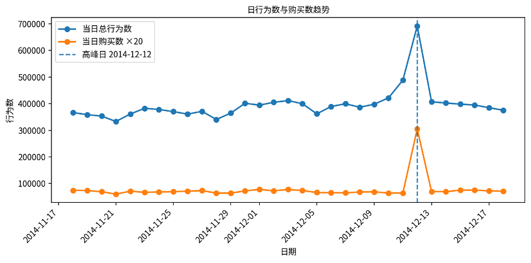
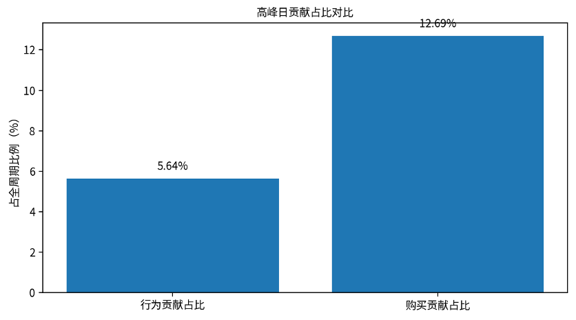
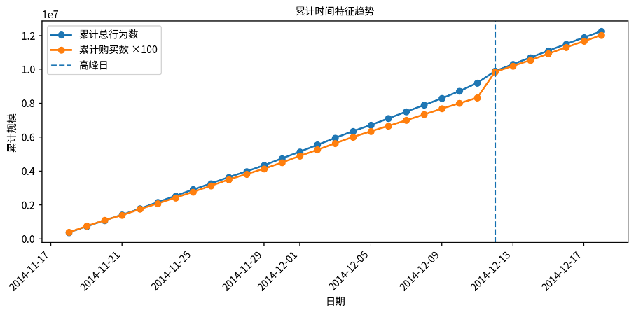
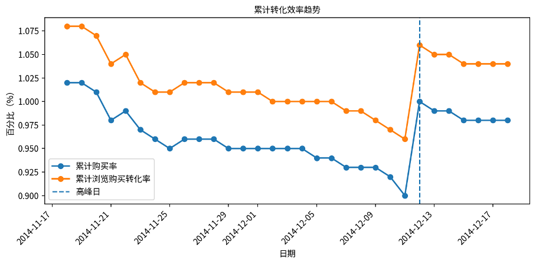
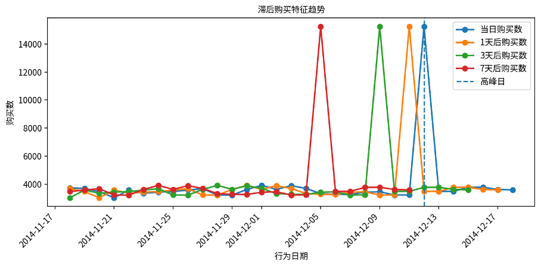

# **衍生特征分析报告**

分析周期：2014-11-18 至 2014-12-18｜数据来源：data\_min 用户行为明细表

# 一、分析目标与指标体系

本报告围绕用户行为时间序列构建三类衍生特征：滞后特征、累计时间特征和高峰日行为占比。衍生特征的作用在于从原始每日行为数据中提取更有解释力的时间关系，用于分析活动冲击、购买释放、累计增长和转化沉淀。

其中，滞后特征关注某一天之后 1 天、3 天、7 天的购买表现；累计时间特征关注从统计起点到当前日期的行为与购买沉淀；高峰日行为占比关注 2014-12-12 对全周期行为与购买的贡献。

| **特征类型** | **核心字段**                                                            | **分析含义**                                              |
| ------------------ | ----------------------------------------------------------------------------- | --------------------------------------------------------------- |
| 滞后特征           | today\_behavior\_count、today\_purchase\_count、purchase\_after\_1d/3d/7d     | 衡量当前日期后续 1/3/7 天的购买表现，用于识别活动前后购买释放。 |
| 累计时间特征       | cumulative\_total\_behavior、cumulative\_purchase、cumulative\_purchase\_rate | 衡量从起始日期到当前日期的累计行为规模与累计转化效率。          |
| 高峰日行为占比     | peak\_day\_behavior\_share、peak\_day\_purchase\_share                        | 衡量 2014-12-12 对全周期行为数和购买数的贡献程度。              |

# 二、数据概览

| **指标**         | **结果** |
| ---------------------- | -------------- |
| 统计天数               | 31 天          |
| 全周期总行为数         | 12,256,906     |
| 全周期总购买数         | 120,205        |
| 平均每日行为数         | 395,384        |
| 平均每日购买数         | 3,878          |
| 最终累计购买率         | 0.98%          |
| 最终累计浏览购买转化率 | 1.04%          |

从累计时间特征表看，统计周期共 31 天，最终累计总行为数达到 12,256,906 次，累计购买数达到 120,205 次。最终累计购买率为 0.98%，累计浏览购买转化率为 1.04%。

图1 日行为数与购买数趋势

# 三、高峰日行为占比分析

| **指标**            | **结果** |
| ------------------------- | -------------- |
| 高峰日                    | 2014-12-12     |
| 高峰日行为数              | 691,712        |
| 全周期行为数              | 12,256,906     |
| 高峰日行为占比            | 5.64%          |
| 高峰日购买数              | 15,251         |
| 全周期购买数              | 120,205        |
| 高峰日购买占比            | 12.69%         |
| 高峰日行为数 / 日均行为数 | 1.75 倍        |
| 高峰日购买数 / 日均购买数 | 3.93 倍        |

2014-12-12 是本周期最突出的行为与购买高峰日。当日贡献了 5.64% 的全周期行为数，但贡献了 12.69% 的全周期购买数，购买贡献明显高于行为贡献。按日均水平比较，12月12日行为数约为日均行为数的 1.75 倍，购买数约为日均购买数的 3.93 倍，说明该日期不仅流量提升明显，购买转化释放更为集中。

从贡献结构看，高峰日购买占比约为行为占比的 2.25 倍，说明该日的购买拉动强度高于普通行为流量拉动，具有明显活动型转化特征。

图2 高峰日行为贡献与购买贡献对比

# 四、累计时间特征分析

累计时间特征以日期为时间轴，逐日累加行为数、浏览数、收藏数、加购数和购买数。与单日指标相比，累计指标更适合观察长期沉淀和活动节点对整体累计曲线的影响。

| **指标**             | **结果** |
| -------------------------- | -------------- |
| 12月11日累计总行为数       | 9,201,664      |
| 12月12日新增行为数         | 691,712        |
| 12月12日后累计总行为数     | 9,893,376      |
| 高峰日对前一日累计行为增幅 | 7.52%          |
| 12月11日累计购买数         | 83,257         |
| 12月12日新增购买数         | 15,251         |
| 12月12日后累计购买数       | 98,508         |
| 高峰日对前一日累计购买增幅 | 18.32%         |
| 累计购买率变化             | 0.90% → 1.00% |
| 累计浏览购买转化率变化     | 0.96% → 1.06% |

在 12月12日之前，累计购买数为 83,257 次；12月12日单日新增购买 15,251 次，使累计购买数提升到 98,508 次，对前一日累计购买规模的增幅达到 18.32%。相比之下，高峰日对累计总行为数的增幅为 7.52%，说明购买端受到活动刺激更强。

累计购买率在高峰日前后由 0.90% 提升至 1.00%，累计浏览购买转化率由 0.96% 提升至 1.06%。这说明高峰日不仅增加购买总量，也改善了截至当日的整体累计转化效率。

图3 累计行为与累计购买趋势

图4 累计购买率与累计浏览购买转化率趋势

# 五、滞后特征分析

滞后特征用于描述某个行为日期之后 1 天、3 天、7 天的购买表现。该指标可以帮助识别某些日期是否位于活动前置阶段，以及未来购买是否会在短窗口内集中释放。

图5 滞后购买特征趋势

# 六、抽样验证说明

| **验证对象** | **抽检方式** | **回溯验证逻辑**                                                   | **验证结果** |
| ------------------ | ------------------ | ------------------------------------------------------------------------ | ------------------ |
| 滞后特征           | 随机抽检 10 天     | 回到 data\_min 重新统计抽样日期当天行为数、购买数，以及后 1/3/7 天购买数 | 返回结果一致       |
| 累计时间特征       | 随机抽检 10 天     | 回到 data\_min 重新统计全周期每日行为数据，并重新累计至抽样日期          | 返回结果一致       |

滞后特征和累计时间特征均采用随机抽检 10 天的方式进行验证。验证过程中，滞后特征直接回到原始行为明细表重新统计对应日期及其后续 1、3、7 天购买数；累计时间特征则先重新生成全周期每日行为汇总，再按日期顺序计算累计值。两类抽检结果均一致，说明衍生特征统计逻辑可靠。

# 七、综合结论与运营建议

1. 2014-12-12 是明显的活动型高峰日，当日行为占比为 5.64%，购买占比为 12.69%，购买集中程度显著高于行为集中程度。
2. 高峰日对累计购买的拉动强于对累计行为的拉动，单日新增购买使累计购买规模较前一日增加 18.32%，说明活动对成交释放具有强刺激作用。
3. 滞后特征显示，活动前 1 天、3 天、7 天的行为日期均能在后续购买字段中体现 12月12日购买峰值，说明该指标适合用于活动复盘和周期性购买释放分析。
4. 建议在运营排期上关注高峰日前 3 至 7 天的蓄水期，通过收藏、加购、优惠提醒和定向触达提前培育购买意向。
