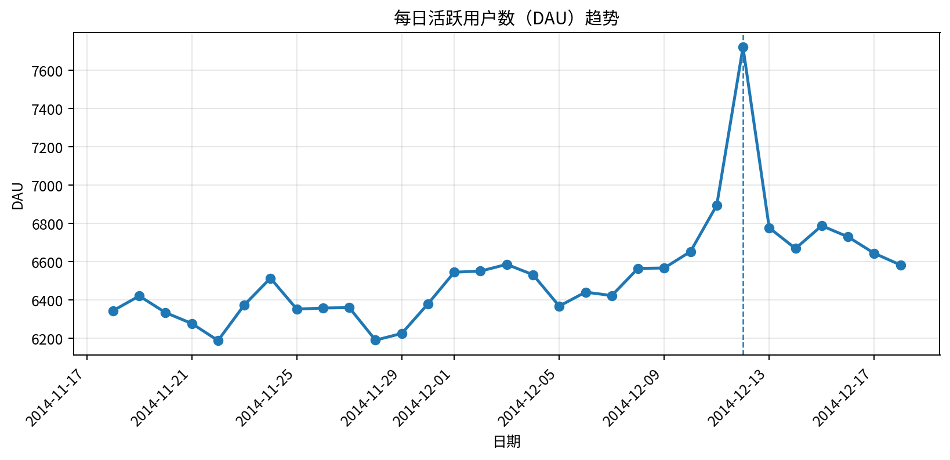
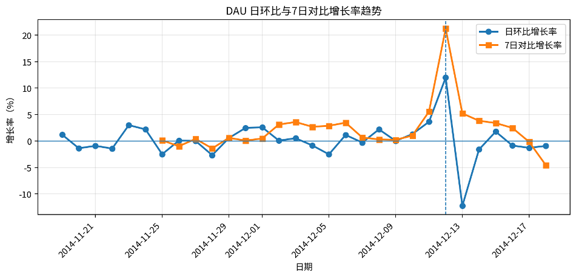
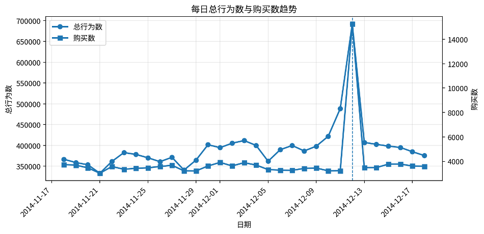
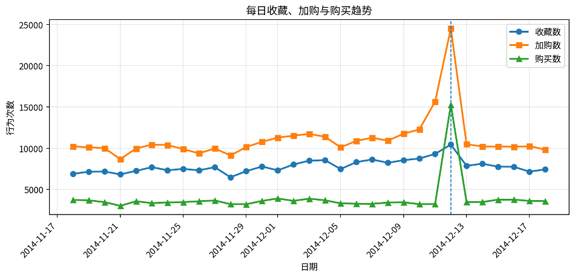
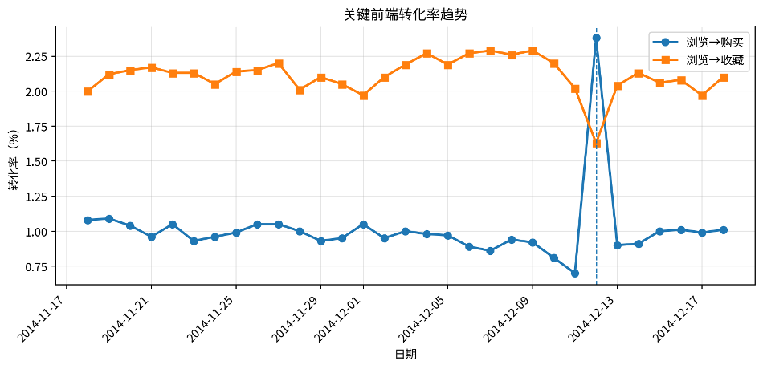
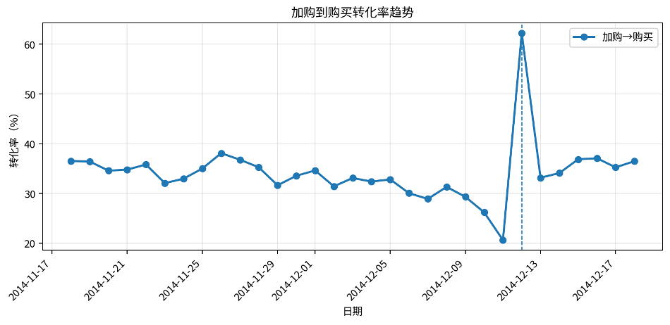
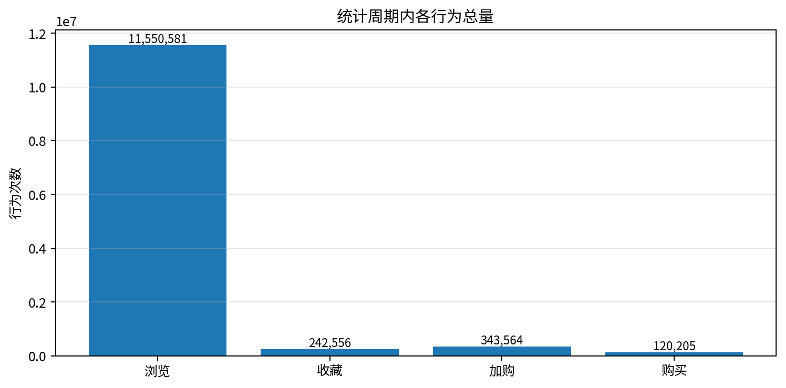

# **日趋势分析报告**

数据周期：2014-11-18 至 2014-12-18｜统计天数：31 天

本报告基于 DAU 结果表与日行为总量及转化率结果表，对每日活跃用户、行为规模、购买行为和关键转化率进行趋势分析。日转化率和 DAU 相关结果均已随机抽检 10 天并回到原始明细表重新计算，返回值一致，说明统计逻辑可靠。

# 一、核心结论

* 统计周期内总行为数为 12,256,906 次，其中浏览 11,550,581 次、收藏 242,556 次、加购 343,564 次、购买 120,205 次，购买行为占总行为的 0.98%。
* 平均 DAU 为 6,527 人，DAU 峰值出现在 2014-12-12，达到 7,720 人；最低值出现在 2014-11-22，为 6,187 人。
* 2014-12-12 是整体流量与交易表现最突出的日期：总行为数 691,712 次，购买数 15,251 次，浏览到购买转化率 2.38%。
* DAU 与总行为数相关系数为 0.921，DAU 与购买数相关系数为 0.790，说明活跃用户规模与行为规模、购买规模整体同向变化。
* 从趋势看，12月12日形成明显峰值，结合日期特征，可能与双十二促销活动带来的集中访问和购买转化有关；活动后 DAU 与购买数回落，但后续仍保持在相对稳定区间。

# 二、数据概览与指标口径

| **指标**       | **数值**           |
| -------------------- | ------------------------ |
| 统计周期             | 2014-11-18 至 2014-12-18 |
| 统计天数             | 31 天                    |
| 总行为数             | 12,256,906               |
| 总浏览数             | 11,550,581               |
| 总收藏数             | 242,556                  |
| 总加购数             | 343,564                  |
| 总购买数             | 120,205                  |
| 平均 DAU             | 6,527                    |
| 平均浏览→购买转化率 | 1.01%                    |
| 平均加购→购买转化率 | 34.18%                   |

指标口径说明：DAU 指每日发生至少一次行为的去重用户数；日行为总量包括浏览、收藏、加购和购买四类行为；各环节转化率采用每日行为次数汇总口径计算。

# 三、DAU 日趋势分析

*图1 每日活跃用户数（DAU）趋势*

DAU 在统计周期内整体保持在 6,000 人以上，平均为 6,527 人。峰值出现在 2014-12-12，达到 7,720 人，较前一日增长 11.98%，较前 7 日增长 21.25%。这说明该日不仅用户访问规模明显提升，而且相对于前一周也出现了显著放大。

*图2 DAU 日环比与7日对比增长率趋势*

日环比最大增长出现在 2014-12-12，增长率为 11.98%；最大回落出现在 2014-12-13，日环比为 -12.23%。这表明峰值后的用户活跃度出现自然回落，符合促销活动或集中消费节点后的流量衰减特征。

| **日期** | **DAU** | **日环比** | **7日对比** |
| -------------- | ------------- | ---------------- | ----------------- |
| 2014-12-12     | 7,720         | 11.98%           | 21.25%            |
| 2014-12-11     | 6,894         | 3.64%            | 5.56%             |
| 2014-12-15     | 6,787         | 1.78%            | 3.40%             |
| 2014-12-13     | 6,776         | -12.23%          | 5.22%             |
| 2014-12-16     | 6,729         | -0.85%           | 2.48%             |

# 四、日行为总量与购买趋势分析

*图3 每日总行为数与购买数趋势*

总行为数峰值同样出现在 2014-12-12，达到 691,712 次，明显高于统计周期平均水平。购买数峰值也出现在同一天，达到 15,251 次，说明该日并非只有访问上升，而是浏览、加购与购买均出现同步放大。

*图4 每日收藏、加购与购买趋势*

从收藏、加购和购买趋势看，购买行为在大多数日期保持相对平稳，12月12日出现极端峰值。加购行为在该日同样大幅上升，说明用户在购买前的决策行为也被明显激活。

| **日期** | **总行为数** | **浏览数** | **加购数** | **购买数** | **浏览→购买** |
| -------------- | ------------------ | ---------------- | ---------------- | ---------------- | -------------------- |
| 2014-12-12     | 691,712            | 641,507          | 24,508           | 15,251           | 2.38%                |
| 2014-12-11     | 488,508            | 460,329          | 15,643           | 3,226            | 0.70%                |
| 2014-12-10     | 421,910            | 397,661          | 12,280           | 3,216            | 0.81%                |
| 2014-12-03     | 411,606            | 387,497          | 11,732           | 3,885            | 1.00%                |
| 2014-12-13     | 407,160            | 385,337          | 10,486           | 3,478            | 0.90%                |

# 五、日转化率趋势分析

*图5 浏览到收藏与浏览到购买转化率趋势*

浏览到购买转化率均值为 1.01%，峰值出现在 2014-12-12，达到 2.38%。相比其他日期，该日不仅流量高，而且购买效率明显提升，说明用户购买意愿更强。

*图6 加购到购买转化率趋势*

加购到购买转化率均值为 34.18%，峰值出现在 2014-12-12，达到 62.23%。这说明在关键日期，已经进入加购阶段的用户更容易完成购买。

*图7 统计周期内各行为总量*

整体行为结构中，浏览行为占绝对主体，收藏、加购和购买行为属于更深层的意向与交易行为。后续运营分析中，可以将浏览到购买转化率作为整体效率指标，将加购到购买转化率作为临近交易阶段效率指标。

# 六、抽样验证说明

* DAU 增长率结果已随机抽取 10 天，并回到原始行为明细表 data\_min 中重新统计当天 DAU、前一日 DAU 和前 7 日 DAU，再重新计算日环比和 7 日对比增长率，返回值一致。
* 日行为总量及转化率结果已随机抽取 10 天，并回到原始行为明细表 data\_min 中重新统计每日总行为数、浏览数、收藏数、加购数和购买数，再重新计算各环节转化率，返回值一致。
* 因此，本报告使用的日趋势指标在抽样验证范围内与原始明细数据保持一致，统计逻辑可靠，可用于后续趋势分析和报告结论。

# 七、运营建议

* 围绕 12月12日这类高峰节点复盘活动机制，重点分析流量来源、加购转购买效率和高转化商品，以沉淀可复用的活动策略。
* 将 DAU 与购买数、总行为数联动监控，识别“高活跃但低转化”日期，进一步定位流量质量或商品承接问题。
* 对加购后未购买用户进行重点触达，例如优惠券、库存提醒、限时促销和个性化推荐，提高加购到购买转化。

# 八、附录：数据来源

| **文件**                                  | **内容**                                                         |
| ----------------------------------------------- | ---------------------------------------------------------------------- |
| DAU.csv / DAU.sql                               | 每日活跃用户数、前一日 DAU、前 7 日 DAU、日环比增长率和 7 日对比增长率 |
| 日行为总量及转化率.csv / 日行为总量及转化率.sql | 每日总行为数、浏览数、收藏数、加购数、购买数及四类转化率               |
