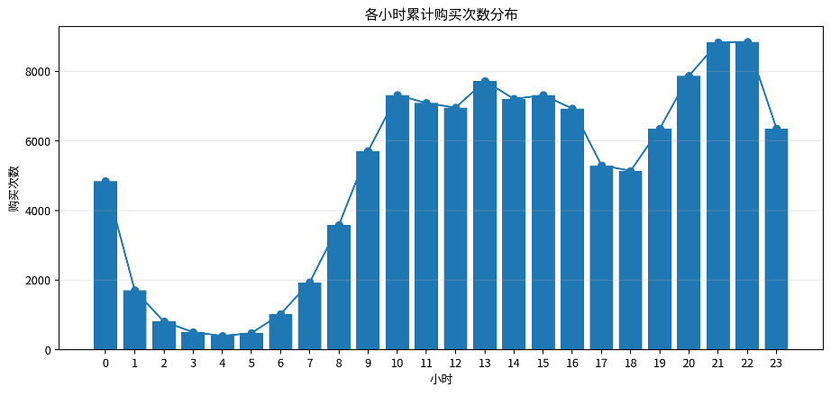
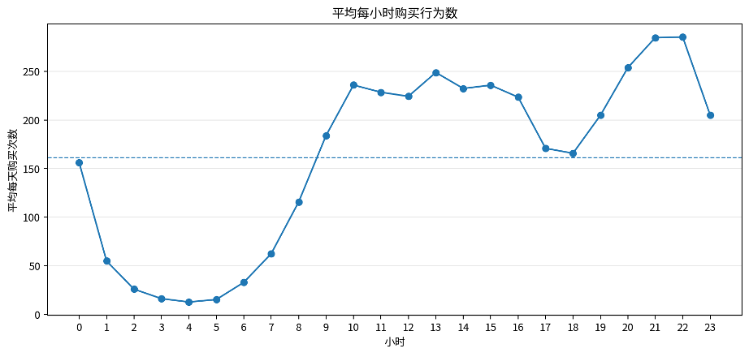
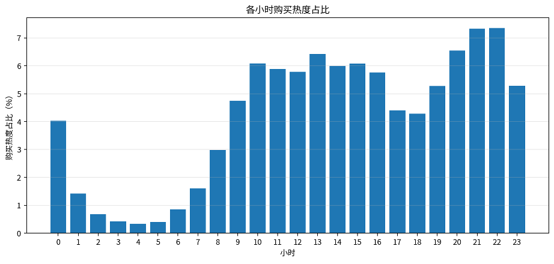
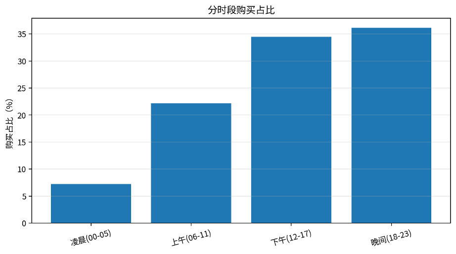
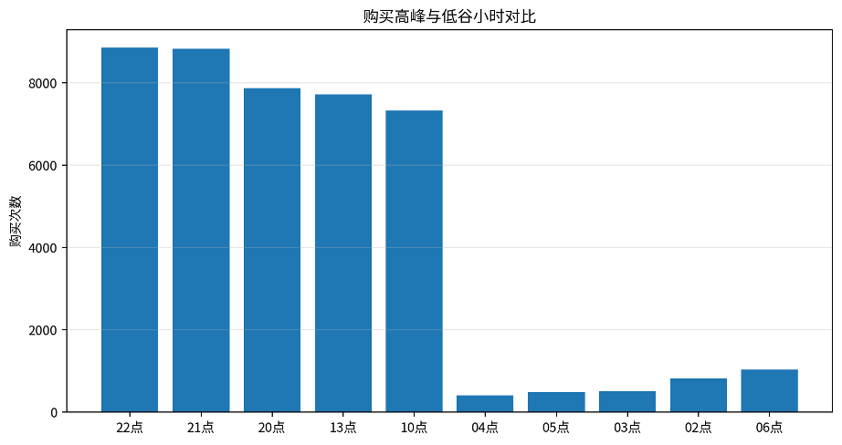

# 小时趋势分析报告

基于小时购买热度分布的用户购买时间偏好分析

# 一、分析目标与数据口径

本报告围绕用户购买行为的小时分布展开分析，目标是识别一天中购买行为的高峰、低谷，以及不同小时段的平均购买强度。分析对象为购买行为，统计口径为 behavior\_type = 4；小时维度通过 HOUR(event\_time) 提取，覆盖 0 点至 23 点共 24 个小时。

| **指标**         | **结果**                    |
| ---------------------- | --------------------------------- |
| 统计周期天数           | 31 天                             |
| 总购买行为数           | 120,205 次                        |
| 整体平均每小时购买次数 | 5,008.54 次                       |
| 平均每天每小时购买次数 | 161.57 次                         |
| 最高峰小时             | 22:00-22:59，8,845 次，占比 7.36% |
| 最低谷小时             | 04:00-04:59，397 次，占比 0.33%   |

# 二、小时购买趋势表现

从 24 小时分布看，购买行为具有明显的时段差异。最高峰出现在 22:00-22:59，累计购买 8,845 次，平均每天约 285.32 次，占全部购买行为的 7.36%。最低谷出现在 04:00-04:59，累计购买 397 次，平均每天约 12.81 次，占比仅 0.33%。最高峰购买次数约为最低谷的 22.28 倍，说明用户购买行为在时间上高度不均匀。

*图1 各小时累计购买次数分布*

*图2 平均每小时购买行为数趋势*

# 三、购买热度与高峰低谷分析

购买热度按“某小时购买次数 / 全部购买次数”计算。晚间 20:00-22:59 是最突出的连续高峰窗口，三小时合计购买 25,546 次，占全部购买行为的 21.25%。同时，10:00-16:59 也保持较高购买强度，合计购买 50,525 次，占比 42.03%，说明用户购买行为并非只集中在单一夜间高峰，而是在日间和晚间形成双峰式活跃结构。

*图3 各小时购买热度占比*

*图4 分时段购买占比*

# 四、高峰与低谷小时明细

购买次数排名前五的小时主要集中在晚间与午后，说明这些时段更适合安排促销提醒、商品推荐和购买转化类运营动作。

| **高峰小时** | **购买次数** | **平均每天购买次数** | **购买占比** |
| ------------------ | ------------------ | -------------------------- | ------------------ |
| 22:00-22:59        | 8845               | 285.32                     | 7.36%              |
| 21:00-21:59        | 8829               | 284.81                     | 7.34%              |
| 20:00-20:59        | 7872               | 253.94                     | 6.55%              |
| 13:00-13:59        | 7717               | 248.94                     | 6.42%              |
| 10:00-10:59        | 7317               | 236.03                     | 6.09%              |

购买次数排名后五的小时主要集中在凌晨，用户购买意愿和交易行为明显偏弱，除特殊活动外，不宜将强转化类投放集中在这些时段。

| **低谷小时** | **购买次数** | **平均每天购买次数** | **购买占比** |
| ------------------ | ------------------ | -------------------------- | ------------------ |
| 04:00-04:59        | 397                | 12.81                      | 0.33%              |
| 05:00-05:59        | 476                | 15.35                      | 0.40%              |
| 03:00-03:59        | 504                | 16.26                      | 0.42%              |
| 02:00-02:59        | 806                | 26.00                      | 0.67%              |
| 06:00-06:59        | 1023               | 33.00                      | 0.85%              |

*图5 购买高峰与低谷小时对比*

# 五、业务解读

晚间购买高峰明显：20:00-22:59 合计贡献 21.25% 的购买行为，其中 22:00-22:59 为全日最高峰。

日间存在稳定购买带：10:00-16:59 购买占比超过四成，说明办公/午后时段也存在较强交易活跃度。

凌晨为明显低谷：02:00-06:59 用户购买行为显著减少，其中 04:00-04:59 是最低谷。

小时购买热度差异较大：高峰小时与低谷小时相差超过 20 倍，运营排期应避免平均化投放。

# 六、运营建议

**•** 晚间高峰强化转化：建议在 20:00-23:00 加强限时优惠、购物车召回、优惠券提醒和直播/活动入口曝光。

**•** 日间活跃时段承接种草与加购：10:00-16:00 可重点投放商品推荐、类目会场、收藏加购提醒，为晚间购买高峰做转化蓄水。

**•** 凌晨低谷减少强投放：02:00-06:00 购买热度较低，可降低付费触达和强促销推送频率，避免资源浪费。

**•** 按小时做精细化触达：结合用户历史购买时段偏好，面向晚间活跃用户设置专属提醒，提升触达效率。

# 七、抽样验证说明

为验证小时购买热度分布结果的准确性，本文从小时购买热度结果表中随机抽取 10 个小时，并回到原始行为明细表 data\_min 中重新统计对应小时的购买行为数。同时重新计算统计周期天数、总购买次数、平均每小时购买行为数和购买热度，并与结果表进行对比。随机抽检 10h 的返回值均一致，说明小时购买热度分布统计逻辑可靠。
