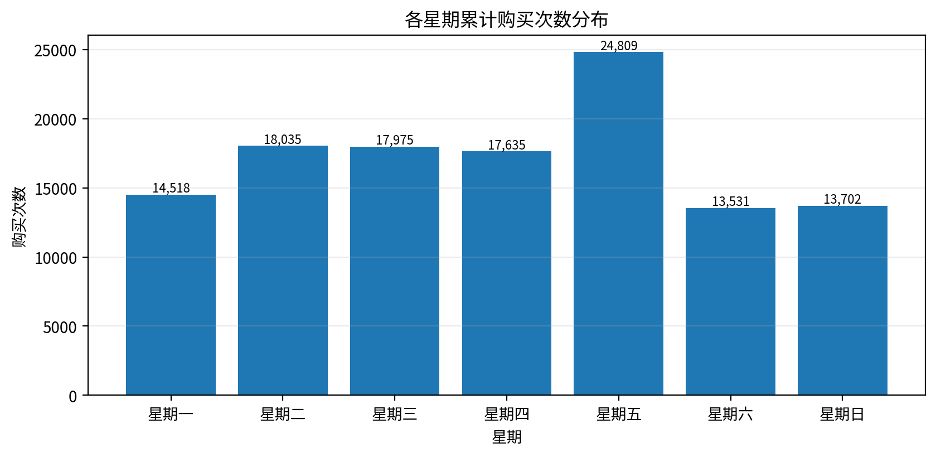
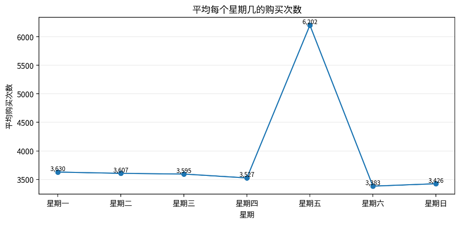
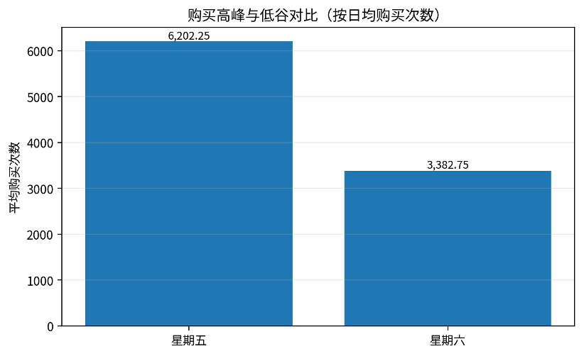
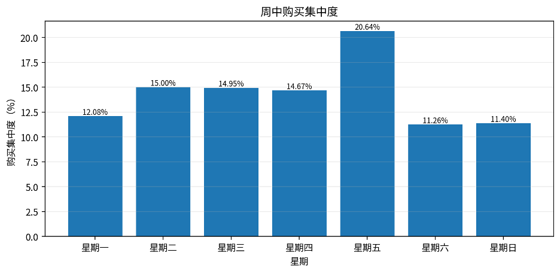

# **周趋势分析报告**

基于周中购买集中度的用户购买时间偏好分析

# 一、指标口径与数据说明

周趋势分析关注一周内不同星期的购买活跃差异。为避免不同星期在统计周期内出现天数不同造成偏差，报告同时使用累计购买次数和平均每个星期几购买次数两个指标进行判断。

| **字段**                   | **说明**                          |
| -------------------------------- | --------------------------------------- |
| purchase\_count                  | 该星期几累计购买次数                    |
| weekday\_days                    | 该星期几在统计周期内出现的天数          |
| avg\_purchase\_per\_weekday      | 该星期几累计购买次数 / 该星期几出现天数 |
| purchase\_concentration          | 该星期几购买次数 / 全部购买次数         |
| purchase\_concentration\_percent | 购买集中度的百分比形式                  |

# 二、核心结论摘要

* 购买高峰集中在星期五，平均每个星期五购买次数为 6,202.25 次，累计购买次数为 24,809 次，购买集中度为 20.64%。
* 购买低谷出现在星期六，平均每个星期六购买次数为 3,382.75 次，累计购买次数为 13,531 次，购买集中度为 11.26%。
* 按日均购买强度看，高峰与低谷相差 2,819.50 次，高峰约为低谷的 1.83 倍，说明周内购买行为存在明显时间集中。
* 工作日累计购买 92,972 次，占比 77.34%；周末累计购买 27,233 次，占比 22.66%。按日均购买看，工作日平均 4,042.26 次/天，周末平均 3,404.12 次/天。

# 三、周中购买分布总览

从累计购买次数看，星期五购买次数明显高于其他星期，是本周期最突出的购买高峰日。星期二、星期三和星期四累计购买次数接近，但由于这些星期在周期内出现 5 次，累计值会高于只出现 4 次的星期。因此，判断周中趋势时应重点参考“平均每个星期几购买次数”。

图中展示了星期一至星期日的累计购买次数。累计购买次数反映整体贡献，但会受到统计周期内该星期出现天数影响。

# 四、按日均购买强度识别高峰与低谷

平均每个星期几购买次数可以消除不同星期出现天数差异，更适合识别真实的周内购买强度。结果显示，星期五的日均购买次数最高，明显高于其他星期；星期六最低，周末整体购买强度相对偏低。

高峰日为星期五，日均购买 6,202.25 次；低谷日为星期六，日均购买 3,382.75 次。两者差距为 2,819.50 次，说明用户在周五的购买意愿或促销响应更强。

# 五、购买集中度分析

购买集中度表示某个星期几购买次数占全部购买次数的比例。集中度越高，说明购买行为越集中在该星期。结果显示，星期五购买集中度最高，为全部购买行为的重要贡献日；周六和周日集中度相对较低，说明周末购买行为不如工作日活跃。

# 六、抽样验证说明

为验证周中购买集中度统计结果的准确性，本文从结果中随机抽样 3 周进行回溯验证，并回到原始行为明细表 data\_min 中重新统计对应星期的购买次数、星期出现天数、总购买次数及购买集中度。抽样验证结果均一致，说明周中购买集中度统计逻辑可靠。

# 七、运营建议

* 将星期五作为重点运营窗口。星期五的购买集中度和日均购买次数均最高，适合安排促销活动、优惠券发放、核心商品推荐和转化冲刺。
* 周末可侧重唤醒和种草。周六和周日购买强度偏低，可通过预热内容、加购提醒、浏览召回等方式提升转化。
* 工作日中段保持稳定投放。星期二至星期四购买规模较接近，可用于维持基础推荐、常规活动和用户复访。

# 十、结论

整体来看，统计周期内购买行为呈现明显的周内差异。星期五是购买高峰，周末尤其是星期六相对偏低。该结果说明用户购买行为并非均匀分布在一周各天，而是存在较强的工作日集中和周五高峰特征。运营上应围绕高峰日强化转化动作，并针对低谷日设计唤醒和预热策略。
