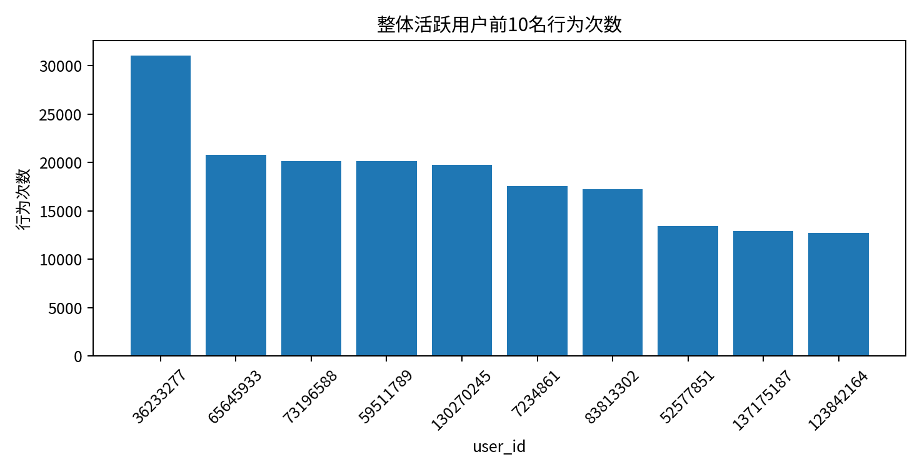
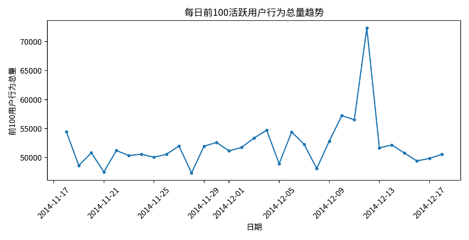
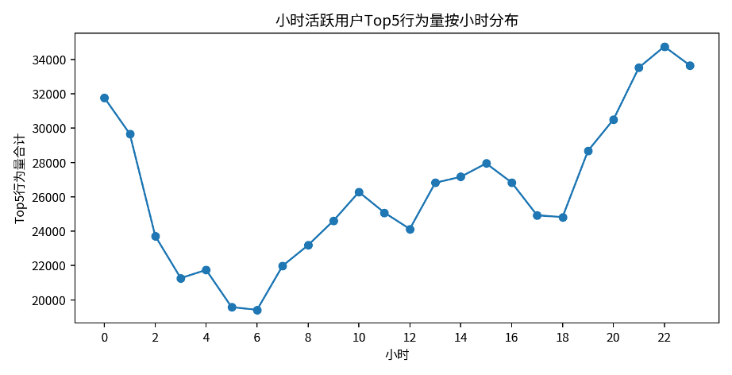
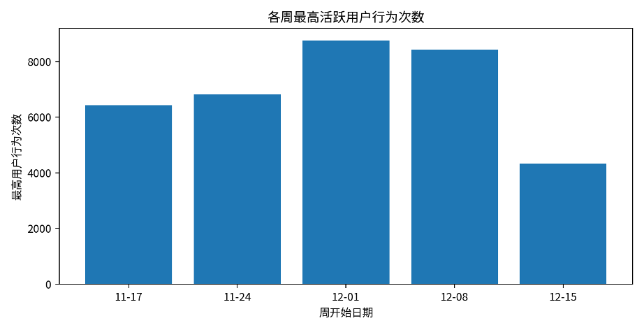

# **活跃用户排名分析报告**

# 基于整体、日、小时、周维度的用户行为次数排名与抽样验证

# 一、分析口径与数据表说明

| **表名/维度** | **统计口径**                                                       | **用途**       |
| ------------------- | ------------------------------------------------------------------------ | -------------------- |
| 整体活跃用户前百名  | 按整个调查期对 user\_id 分组，统计行为次数并取前100名                    | 整体识别高活跃用户   |
| 日活跃用户          | 按日期和 user\_id 分组，统计用户当日行为次数；每日期保留前100名          | 识别每日高活跃用户   |
| 小时活跃用户        | 按 event\_time 和 user\_id 分组，统计用户每小时行为次数；每小时保留前5名 | 识别小时级高活跃用户 |
| 周活跃用户          | 按自然周和 user\_id 分组，统计用户每周行为次数；每周保留前1000名         | 识别周维度高活跃用户 |

抽样验证说明：整体活跃用户随机抽检10条；日活跃用户逐日分层随机抽样，每层5个样本；小时活跃用户逐日分层随机抽样，每层5个样本；周活跃用户逐周分层随机抽样，每层5个样本，抽检结果均与原始表回溯结果一致。

# 二、整体活跃用户排名分析

整体维度下共保留行为次数最高的前100名用户。排名第一的用户为 36233277，整个调查期行为次数为 31,030 次；前100名用户平均行为次数为 9749.62 次，中位数为 8563 次，前百名最低行为次数为 7,111 次。

从前10名分布看，头部用户行为次数差异较明显，第一名明显高于其他用户，说明整体行为贡献存在一定头部集中现象。

| **用户ID** | **行为次数** |
| ---------------- | ------------------ |
| 36233277         | 31,030             |
| 65645933         | 20,770             |
| 73196588         | 20,146             |
| 59511789         | 20,129             |
| 130270245        | 19,786             |
| 7234861          | 17,574             |
| 83813302         | 17,248             |
| 52577851         | 13,419             |
| 137175187        | 12,908             |
| 123842164        | 12,705             |

# 三、日活跃用户排名分析

日活跃用户表按日期分组后，对每一天的活跃用户按行为次数降序排序，并保留每日前100名。

每日第一名用户中，最高单日行为次数出现在 2014-12-16，用户 130270245 当日行为次数为 2,663 次；每日前100名行为总量最高出现在 2014-12-12，合计 72,316 次。

从趋势看，12月中旬附近每日高活跃用户的行为总量较突出，说明活动或促销节点可能带动了头部用户在短期内集中访问和操作。

| **日期** | **每日前100用户行为总量** |
| -------------- | ------------------------------- |
| 2014-12-12     | 72,316                          |
| 2014-12-10     | 57,229                          |
| 2014-12-11     | 56,522                          |
| 2014-12-04     | 54,717                          |
| 2014-11-18     | 54,477                          |

# 四、小时活跃用户排名分析

小时活跃用户表按 event\_time 和 user\_id 分组，统计每个用户在每个小时内的行为次数，并按小时保留前5名。

单小时用户最高行为次数出现在 2014-12-07 01:00:00，用户 130270245 在该小时产生 862 次行为。每小时Top5行为合计最高出现在 2014-11-20 23:00:00，合计 1,508 次。

小时级结果可以用于识别用户行为集中爆发的时间段，也能辅助判断活动高峰、用户访问习惯以及系统流量压力时点。

# 五、周活跃用户排名分析

周活跃用户表以自然周为分组单位，统计每位用户在该周内的行为总次数并排序，并保留每周行为次数最高的前1000名用户。当前结果覆盖 5 个自然周，各周均保留 1,000 至 1,000 名用户，说明周维度已按每周前1000名口径更新。

周维度最高活跃用户出现在 2014-12-01 至 2014-12-07，用户 36233277 该周行为次数为 8,743 次。

周活跃排名比日和小时维度更能反映用户的持续活跃能力。部分用户在单日或单小时表现突出，但周维度仍能进一步区分稳定活跃用户与短期爆发用户。

| **周开始** | **周结束** | **该周第一名用户** | **行为次数** |
| ---------------- | ---------------- | ------------------------ | ------------------ |
| 2014-11-17       | 2014-11-23       | 36233277                 | 6,423              |
| 2014-11-24       | 2014-11-30       | 65645933                 | 6,817              |
| 2014-12-01       | 2014-12-07       | 36233277                 | 8,743              |
| 2014-12-08       | 2014-12-14       | 36233277                 | 8,422              |
| 2014-12-15       | 2014-12-21       | 130270245                | 4,328              |

# 六、抽样验证结果

| **验证对象** | **抽样方式**            | **验证结论**       |
| ------------------ | ----------------------------- | ------------------------ |
| 整体活跃用户前百名 | 随机抽检10条                  | 均与原始明细回溯结果一致 |
| 日活跃用户排名     | 逐日分层随机抽样，每层5个样本 | 均与原始明细回溯结果一致 |
| 小时活跃用户排名   | 逐日分层随机抽样，每层5个样本 | 均与原始明细回溯结果一致 |
| 周活跃用户排名     | 逐周分层随机抽样，每层5个样本 | 均与原始明细回溯结果一致 |

抽样验证结果说明各排名表在“分组维度、用户ID、行为次数统计”三个核心环节上均能与原始明细表对应，统计过程具有较好的可复核性。

# 七、结论与建议

* 整体维度显示头部用户贡献突出，前100名用户中第一名行为次数达到31,030次，显著高于前百名均值。
* 日维度更新为每日前100名后，可以更清晰观察每天高活跃用户群体的变化，其中2014-12-12的前100用户行为总量达到峰值。
* 小时维度更新为每小时前5名后，更适合识别短时行为爆发和高峰时段，可用于活动流量监测。
* 周维度更新为每周前1000名后，能够在保留足够样本规模的同时识别持续高活跃用户，可与日、小时结果结合区分稳定高活跃用户和短期爆发用户。
* 抽样验证结果均一致，说明当前各维度活跃用户排名表的统计逻辑可靠。
