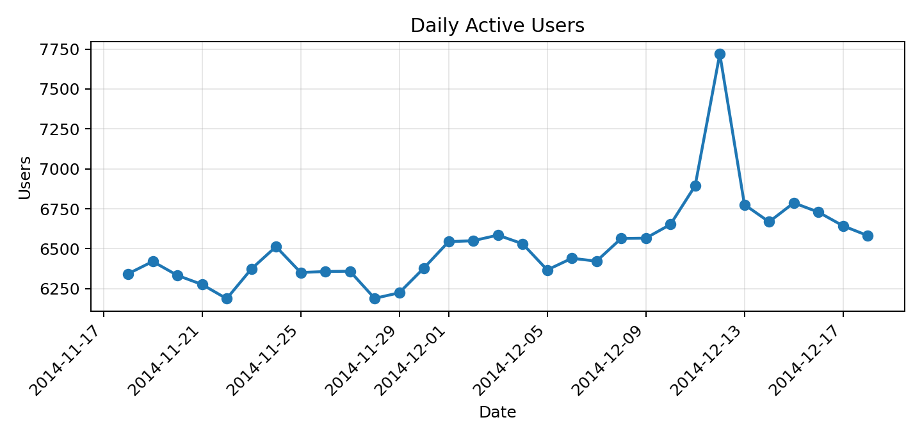
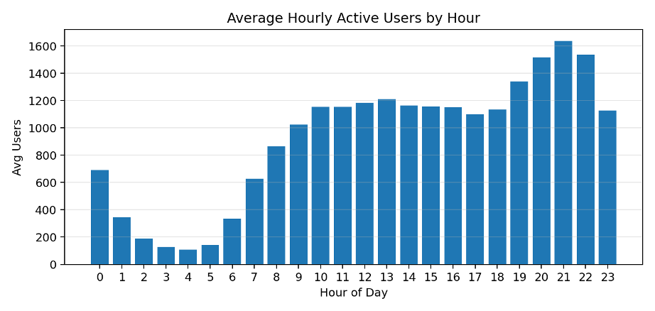
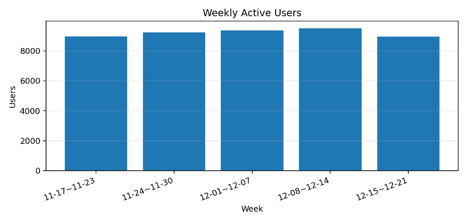

# **活跃度分析报告**

基于日活跃度、小时活跃度与周活跃度统计结果

分析周期：2014-11-18 至 2014-12-18

| **指标**   | **结果**                    |
| ---------------- | --------------------------------- |
| 日活跃度记录数   | 31 天                             |
| 小时活跃度记录数 | 744 小时                          |
| 周活跃度记录数   | 5 周                              |
| 日均活跃用户数   | 6,527                             |
| 日活跃用户峰值   | 7,720（2014-12-12）               |
| 日活跃用户最低值 | 6,187（2014-11-22）               |
| 最活跃小时       | 2014-12-12 21:00，2,287 人        |
| 周活跃用户峰值   | 9,506（2014-12-08 至 2014-12-14） |

# 一、分析口径与数据来源

本报告围绕用户活跃度展开分析，使用日活跃度、小时活跃度、周活跃度三个结果表。活跃用户定义为在对应时间粒度内至少发生过一次行为的去重用户。

| **口径**        | **定义**                       | **SQL统计逻辑**                                                            |
| --------------------- | ------------------------------------ | -------------------------------------------------------------------------------- |
| 日活跃用户数（DAU）   | 某自然日内发生过任意行为的去重用户数 | 按 DATE(event\_time) 分组，COUNT(DISTINCT user\_id)                              |
| 小时活跃用户数（HAU） | 某小时内发生过任意行为的去重用户数   | 按 DATE\_FORMAT(event\_time, "%Y-%m-%d %H:00:00") 分组，COUNT(DISTINCT user\_id) |
| 周活跃用户数（WAU）   | 某自然周内发生过任意行为的去重用户数 | 以周一为周起点，按 week\_start\_date 分组，COUNT(DISTINCT user\_id)              |

抽样验证结果显示：日活跃度表随机抽检 10 条一致，小时活跃度表随机抽检 10 条一致，周活跃度表随机抽检 5 条一致。因此，本报告后续分析建立在已通过抽样回溯验证的汇总结果之上。

# 二、日活跃用户分析

分析周期共 31 天，日均活跃用户数为 6,527 人，中位数为 6,513 人。日活跃用户数最高出现在 2014-12-12，达到 7,720 人；最低出现在 2014-11-22，为 6,187 人。

从首日到末日，DAU 由 6,343 人变化至 6,582 人，整体增长 3.77%。平均绝对日环比波动约为 2.14%，说明日活跃度整体较稳定，但仍存在局部峰值波动。

图 1 日活跃用户数趋势

从日活跃度结果来看，2014 年 12 月 12 日的日活跃用户数达到 7720 人，为整个统计周期内的峰值。这一异常高点很可能与“双十二”促销活动有关。双十二作为电商平台的重要营销节点，通常会通过满减、优惠券、限时折扣等方式刺激用户集中访问平台，从而带动浏览、收藏、加购和购买等行为同步上升。相比活动前的日活水平，12 月 12 日用户活跃度明显抬升，说明促销活动在短期内有效提升了用户访问意愿和参与程度。活动后几日活跃用户数虽有所回落，但仍保持在相对较高水平，表明双十二活动不仅带来了当天的流量峰值，也可能对后续几天的用户活跃产生了一定延续影响。

# 三、小时活跃用户分析

小时活跃度共覆盖 744 个小时，平均每小时活跃用户数为 918 人。单小时峰值出现在 2014-12-12 21:00，达到 2,287 人；单小时最低值出现在 2014-11-25 04:00，为 82 人。

从小时分布看，用户活跃度明显集中在晚间和部分午后时段。平均活跃最高的时段为 21点（均值1,639人）, 22点（均值1,539人）, 20点（均值1,517人）；低活跃时段集中在凌晨，最低的几个时段为 4点（均值109人）, 3点（均值129人）, 5点（均值140人）。这说明用户访问与行为发生具有明显的日内周期性。

图 2 分小时平均活跃用户数

| **排名** | **小时** | **平均小时活跃用户数** | **单小时峰值** | **单小时最低值** |
| -------------- | -------------- | ---------------------------- | -------------------- | ---------------------- |
| 1              | 21:00          | 1,639                        | 2,287                | 1,384                  |
| 2              | 22:00          | 1,539                        | 2,178                | 1,366                  |
| 3              | 20:00          | 1,517                        | 2,103                | 1,328                  |

# 四、周活跃用户分析

周活跃度共统计 5 个自然周，平均周活跃用户数为 9,199 人。周活跃峰值出现在 2014-12-08 至 2014-12-14，达到 9,506 人。

从前四周看，WAU 由 8,964 人提升至 9,506 人，累计增长 6.05%，呈现持续上升趋势。最后一周统计周期为 2014-12-15 至 2014-12-21，但数据实际截止到 2014-12-18，因此该周存在不完整周影响。

图 3 周活跃用户数趋势

| **周开始日期** | **周结束日期** | **周活跃用户数** | **环比** |
| -------------------- | -------------------- | ---------------------- | -------------- |
| 2014-11-17           | 2014-11-23           | 8,964                  |                |
| 2014-11-24           | 2014-11-30           | 9,224                  | 2.90%          |
| 2014-12-01           | 2014-12-07           | 9,354                  | 1.41%          |
| 2014-12-08           | 2014-12-14           | 9,506                  | 1.62%          |
| 2014-12-15           | 2014-12-21           | 8,947                  | -5.88%         |

# **五、主要结论**

• 整体活跃度较稳定：31 天内日均活跃用户数为 6,527 人，日活最低值与最高值分别为 6,187 人和 7,720 人。

• 存在明显峰值：2014-12-12 日活跃用户数达到峰值，且相较前一日上升 11.98%，可能对应活动、促销或外部流量刺激。

• 小时活跃度呈现明显的日内节律：晚间 20 点至 22 点是用户最活跃区间，凌晨 3 点至 5 点活跃度最低。

• 周活跃用户在前四周持续上升，说明调查期中段用户覆盖面逐步扩大；最后一周由于数据截止日导致统计不完整，不宜直接与完整自然周做强对比。

• 抽样回溯验证结果一致，说明日、小时、周活跃用户数的统计逻辑与汇总结果可信。

# **六、建议**

• 重点关注晚间高峰时段，可将营销触达、活动推送或推荐策略集中在 20 点至 22 点，提高触达效率。

• 对 2014-12-12 的异常高峰建议结合活动、商品曝光、转化率等指标进一步排查，判断其是否为可复用的增长模式。

• 后续分析可将活跃度与购买转化、品类偏好、路径长短等指标结合，进一步评估活跃用户是否真正带来购买增长。

• 周活跃度分析中建议将不完整周单独标注，避免误判周度下滑。
