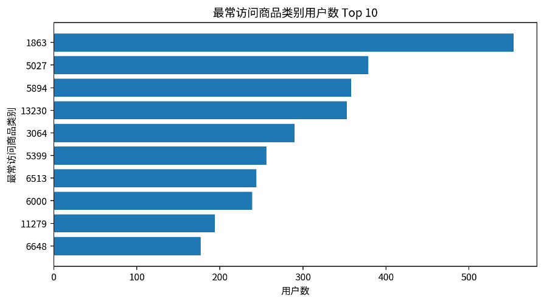
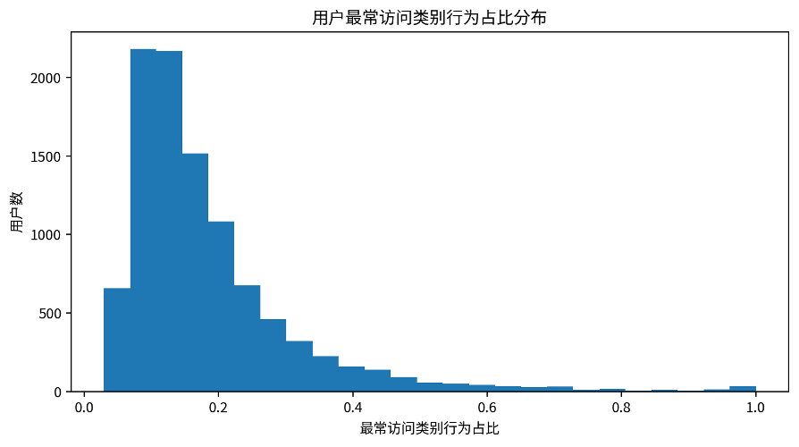

# **最常访问商品类别分析报告**

基于用户行为明细表 data\_min 的用户商品类别偏好分析

# 一、指标口径与分析目的

本报告分析“每个用户最常访问的商品类别”。该指标以用户为分析单位，将浏览、收藏、加购和购买等所有行为都计入访问行为，只要用户在某一商品类别下发生过任意行为，就计入该类别的行为次数。

最常访问商品类别定义为：对每个用户按照 item\_category 汇总行为次数，选择行为次数最多的商品类别作为该用户的 most\_visited\_category。

核心字段包括：user\_id、most\_visited\_category、category\_behavior\_count 和 total\_behavior\_count。其中 category\_behavior\_count 表示该用户在最常访问类别下的行为次数，total\_behavior\_count 表示该用户在调查期间的总行为次数。

整体样本概况如下：

| **指标**             | **结果** |
| -------------------------- | -------------- |
| 用户样本数                 | 10,000         |
| 覆盖商品类别数             | 1,268          |
| 最常访问类别平均行为次数   | 170.08         |
| 最常访问类别行为次数中位数 | 102            |
| 用户总行为次数平均值       | 1225.69        |
| 用户总行为次数中位数       | 747            |
| 最常访问类别行为占比平均值 | 18.33%         |
| 最常访问类别行为占比中位数 | 14.55%         |

# 二、最常访问类别分布特征

统计结果显示，10,000 名用户的最常访问类别共覆盖 1,268 个商品类别，说明用户兴趣分布较为分散，但头部类别仍具有明显的用户聚集效应。

从用户数看，类别 1863 是最常访问用户数最多的类别，共有 554 名用户将其作为最常访问类别。排名靠前的类别还包括 1863, 5027, 5894, 13230, 3064 等。

| **类别** | **用户数** | **类别行为总数** | **人均类别行为数** | **平均类别行为占比** |
| -------------- | ---------------- | ---------------------- | ------------------------ | -------------------------- |
| 1863           | 554              | 121,222                | 218.81                   | 16.37%                     |
| 5027           | 379              | 125,323                | 330.67                   | 17.39%                     |
| 5894           | 358              | 113,473                | 316.96                   | 15.90%                     |
| 13230          | 353              | 116,227                | 329.25                   | 16.09%                     |
| 3064           | 290              | 61,861                 | 213.31                   | 23.41%                     |
| 5399           | 256              | 68,436                 | 267.33                   | 15.29%                     |
| 6513           | 244              | 63,877                 | 261.79                   | 13.81%                     |
| 6000           | 239              | 35,225                 | 147.38                   | 20.85%                     |
| 11279          | 194              | 41,193                 | 212.34                   | 15.59%                     |
| 6648           | 177              | 18,934                 | 106.97                   | 27.35%                     |

图 1 最常访问商品类别用户数 Top 10

# 三、用户类别偏好集中度

为进一步理解用户对最常访问类别的依赖程度，计算 category\_behavior\_count / total\_behavior\_count 作为最常访问类别行为占比。结果显示，该比例平均为 18.33%，中位数为 14.55%，75 分位数为 21.86%。

其中，有 7,016 名用户的最常访问类别行为占比不超过 20%，占样本的 70.16%，说明大多数用户的行为并未高度集中于单一类别，而是在多个类别之间存在一定分散。另一方面，也有 30 名用户的全部行为都集中在一个商品类别上，这部分用户表现出极强的类别偏好。

| **最常访问类别行为占比区间** | **用户数** | **占比** |
| ---------------------------------- | ---------------- | -------------- |
| 0%-20%                             | 7,016            | 70.16%         |
| 20%-40%                            | 2,354            | 23.54%         |
| 40%-60%                            | 440              | 4.40%          |
| 60%-80%                            | 124              | 1.24%          |
| 80%-100%                           | 66               | 0.66%          |

图 2 用户最常访问类别行为占比分布

# 四、抽样验证结果

为验证最常访问商品类别统计结果的准确性，本文采用随机抽样回溯法：从最常访问商品类别表中随机抽取 100 个用户，回到原始行为明细表 data\_min 中按照 user\_id 和 item\_category 重新统计各类别行为次数，并重新识别每位用户的最常访问商品类别。

抽检结果显示，100 个随机样本的 most\_visited\_category、category\_behavior\_count 和 total\_behavior\_count 均与原统计表一致，说明该指标的 SQL 计算口径与原始明细表相匹配，统计结果可靠。

# 五、分析结论与应用建议

第一，用户最常访问类别覆盖范围较广，说明平台用户兴趣具有明显多样性，不能仅依赖少数类别进行用户偏好刻画。

第二，头部类别仍具有较强聚集效应，类别 1863、5027、5894、13230 等在用户最常访问类别中出现频率较高，可作为后续重点分析类别。

第三，多数用户的最常访问类别行为占比低于 20%，表明大量用户存在跨品类浏览和互动行为。若用于用户画像，可进一步结合购买类别、加购类别和浏览深度等指标进行综合判断。

第四，极少数用户的行为高度集中于单一类别，这类用户适合进行更明确的品类偏好推荐或垂直品类营销。
