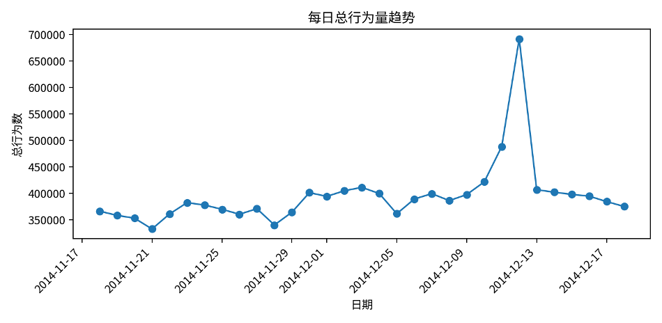
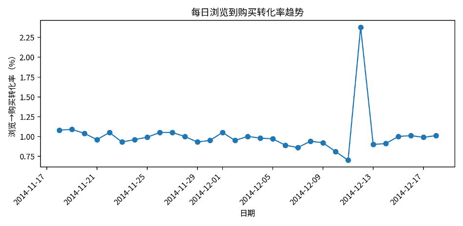
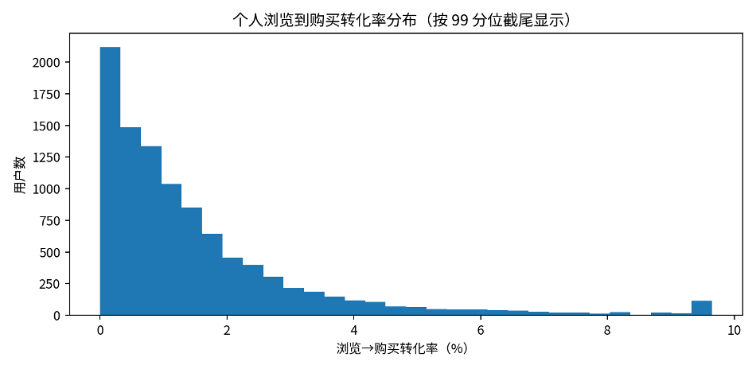

# **用户行为转化率分析报告**

基于整体、日维度与个人维度的普通转化率统计

# 一、分析目标与指标口径

报告围绕用户行为转化率展开分析，数据以 data\_min 原始行为明细表为基础，分别从整体转化率、日转化率和个人转化率三个层面统计。行为类型按照 1=浏览、2=收藏、3=加购、4=购买 进行识别。采用普通行为转化率口径，即后一类行为数量除以前一类行为数量，不要求同一用户严格按照浏览、收藏、加购、购买路径依次完成行为。

| **指标**   | **计算公式** | **含义**                     |
| ---------------- | ------------------ | ---------------------------------- |
| 浏览→收藏转化率 | 收藏数 / 浏览数    | 衡量浏览行为转化为收藏行为的比例   |
| 收藏→加购转化率 | 加购数 / 收藏数    | 衡量收藏行为相对于加购行为的关系   |
| 加购→购买转化率 | 购买数 / 加购数    | 衡量加购行为转化为购买行为的比例   |
| 浏览→购买转化率 | 购买数 / 浏览数    | 衡量从浏览到最终购买的整体转化水平 |

# 二、整体转化率分析

整体层面共统计到 12,256,906 次用户行为，其中浏览 11,550,581 次、收藏 242,556 次、加购 343,564 次、购买 120,205 次。整体浏览到购买转化率为 1.04%，说明每 100 次浏览行为大约对应 1.04 次购买行为。

| **指标**   | **数值** |
| ---------------- | -------------- |
| 总行为数         | 12,256,906     |
| 浏览数           | 11,550,581     |
| 收藏数           | 242,556        |
| 加购数           | 343,564        |
| 购买数           | 120,205        |
| 浏览→收藏转化率 | 2.10%          |
| 收藏→加购转化率 | 141.64%        |
| 加购→购买转化率 | 34.99%         |
| 浏览→购买转化率 | 1.04%          |

从整体漏斗看，浏览行为占绝大多数，浏览到收藏转化率仅为 2.10%，说明用户在浏览阶段流失较明显；加购到购买转化率达到 34.99%，表明一旦用户进入加购环节，其购买意向相对更强。

# 三、日转化率分析

日转化率表覆盖 2014-11-18 至 2014-12-18，共 31 天。每日平均总行为数为 395,384 次，平均购买数为 3,878 次，平均浏览到购买转化率为 1.01%。

| **观察项** | **日期** | **总行为数** | **购买数** | **浏览→购买转化率** | **加购→购买转化率** |
| ---------------- | -------------- | ------------------ | ---------------- | -------------------------- | -------------------------- |
| 总行为峰值       | 2014-12-12     | 691,712            | 15,251           | 2.38%                      | 62.23%                     |
| 购买峰值         | 2014-12-12     | 691,712            | 15,251           | 2.38%                      | 62.23%                     |
| 浏览→购买最高   | 2014-12-12     | 691,712            | 15,251           | 2.38%                      | 62.23%                     |
| 浏览→购买最低   | 2014-12-11     | 488,508            | 3,226            | 0.70%                      | 20.62%                     |

从日期变化看，2014-12-12 同时是总行为数、购买数和浏览到购买转化率的峰值日。与 2014-12-11 相比，12 月 12 日总行为数增长 41.60%，购买数增长 372.75%，浏览到购买转化率由 0.70% 提升至 2.38%。该现象与“双十二”促销节点高度吻合，说明活动不仅带来了行为流量提升，也明显强化了购买转化。

# 四、个人转化率分析

个人转化率表共包含 10,000 名用户。用户平均总行为数为 1225.69 次，中位数为 747 次，说明用户活跃度存在明显差异。购买用户数为 8,886 人，占比 88.86%；未产生购买行为的用户为 1,114 人。

| **统计项**   | **均值**     | **中位数** | **90分位** | **99分位** | **最大值**     |
| ------------------ | ------------------ | ---------------- | ---------------- | ---------------- | -------------------- |
| 总行为数           | 1225.69            | 747              | 2875             | 7096             | 31,030               |
| 浏览数             | 1155.06            | 703              | 2701             | 6675             | 27,720               |
| 收藏数             | 24.26              | 2                | 69               | 285              | 2,935                |
| 加购数             | 34.36              | 12               | 90               | 292              | 1,810                |
| 购买数             | 12.02              | 7                | 28               | 70               | 809                  |
| **user\_id** | **总行为数** | **浏览数** | **加购数** | **购买数** | **浏览→购买** |
| 122338823          | 10,529             | 8,810            | 904              | 809              | 9.18%                |
| 123842164          | 12,705             | 11,342           | 546              | 649              | 5.72%                |
| 51492142           | 9,403              | 8,156            | 598              | 441              | 5.41%                |
| 56560718           | 6,267              | 5,342            | 362              | 251              | 4.70%                |
| 35306096           | 3,536              | 2,641            | 557              | 242              | 9.16%                |

个人维度显示，部分用户购买次数明显高于平均水平，说明平台存在高购买强度用户。对于这类用户，可以进一步结合品类偏好、复购间隔和购买路径长短进行分群，以识别高价值用户和潜在复购用户。

# 五、抽样验证说明

为验证转化率计算结果的可靠性，已分别对个人转化率表和日转化率表进行回溯抽检。个人转化率表随机抽取 100 名用户，回到原始 data\_min 表重新统计总行为数、浏览数、收藏数、加购数和购买数，并重新计算各项转化率；日转化率表随机抽取 100 天，按日期回到原始表重新汇总并核对。

抽样结果显示，个人维度与日维度的行为数量统计均完全一致，说明行为数量汇总逻辑可靠。转化率结果存在少量不完全一致，主要原因是小数保留位数、ROUND 精度或百分比口径差异导致，并不影响行为计数结果的准确性。后续如果需要完全一致，可统一转化率保留小数位和是否乘以 100 的口径。

# 六、结论与建议

**•** 整体浏览到购买转化率为 1.04%，平台整体购买转化水平较低，主要流失集中在浏览后的早期阶段。

**•** 加购到购买转化率为 34.99%，明显高于浏览到购买转化率，说明加购用户具备较强购买意向，应重点关注加购用户的召回和转化。

**•** 2014-12-12 的行为数和购买数显著提升，推测与双十二活动有关。促销节点对用户活跃和购买转化均具有明显拉动作用。

**•** 个人转化率差异较大，应避免只用平均值判断用户质量，可结合购买次数、浏览到购买转化率、路径长短和品类偏好进行分层运营。

**•** 当前转化率属于普通行为数量口径，不代表严格漏斗路径。若要分析用户真实路径，应另行构建同一用户、同一商品或同一品类下的严格时间顺序漏斗。
