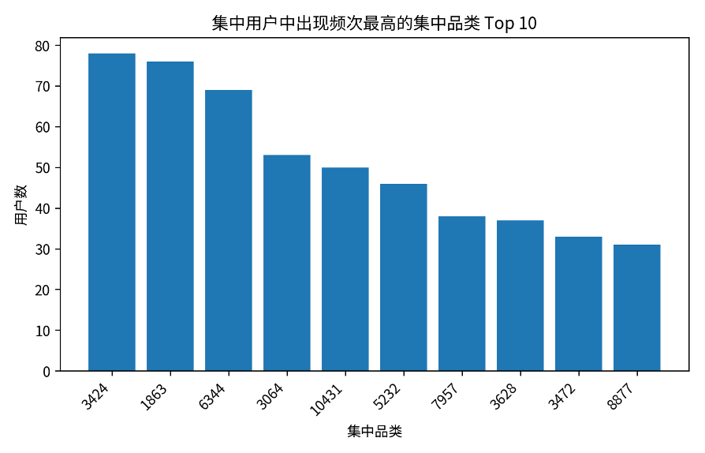

# **行为集中度分析报告**

基于用户购买类别集中度的用户分层分析

# 一、指标定义与计算口径

行为集中度用于衡量用户购买行为是否集中在少数商品类别上。若用户的购买行为主要发生在某一个类别，则说明该用户具有较强的类别偏好；若购买行为分散在多个类别，则说明用户购买兴趣更广泛。

本分析以购买行为为核心，仅使用 behavior\_type = 4 的记录计算用户在各商品类别下的购买次数。对每个用户取购买次数最多的商品类别作为 top\_category，并用该类别购买次数除以用户总购买次数得到 concentration\_rate。

分层规则为：按照 concentration\_rate 从高到低排序，并结合购买次数和 user\_id 作为排序辅助规则，将前 30% 且存在购买行为的用户标记为行为集中用户，其他用户标记为非行为集中用户。行为集中用户保留其 concentrated\_category，非集中用户该字段为空。

| **字段/指标**            | **含义**                                          |
| ------------------------------ | ------------------------------------------------------- |
| top\_category\_purchase\_count | 用户购买最多类别的购买次数                              |
| total\_purchase\_count         | 用户总购买次数                                          |
| concentration\_rate            | top\_category\_purchase\_count / total\_purchase\_count |
| is\_concentrated               | 是否为行为集中用户，1 表示集中，0 表示不集中            |
| concentrated\_category         | 行为集中用户对应的集中购买类别，非集中用户为 NULL       |

# 二、整体分层结果

| **统计项**                           | **结果** |
| ------------------------------------------ | -------------- |
| 总用户数                                   | 10,000         |
| 行为集中用户数                             | 3,000          |
| 非行为集中用户数                           | 7,000          |
| 行为集中用户占比                           | 30.00%         |
| 非集中用户 concentrated\_category 为空数量 | 7,000          |
| 集中用户 concentrated\_category 为空数量   | 0              |

从分层结果看，行为集中用户数量正好占总用户数的 30%，与“按集中度排序取前 30%”的定义一致。非集中用户的 concentrated\_category 为空，说明结果表在分层输出时只为行为集中用户保留集中类别。

# 三、集中用户的类别分布

在行为集中用户中，可以进一步观察 concentrated\_category 的分布，以识别哪些商品类别更容易形成用户的集中购买偏好。下表展示了集中用户中出现频次最高的 10 个集中类别。

| **集中类别** | **集中用户数** | **占集中用户比例** |
| ------------------ | -------------------- | ------------------------ |
| 3424               | 78                   | 2.60%                    |
| 1863               | 76                   | 2.53%                    |
| 6344               | 69                   | 2.30%                    |
| 3064               | 53                   | 1.77%                    |
| 10431              | 50                   | 1.67%                    |
| 5232               | 46                   | 1.53%                    |
| 7957               | 38                   | 1.27%                    |
| 3628               | 37                   | 1.23%                    |
| 3472               | 33                   | 1.10%                    |
| 8877               | 31                   | 1.03%                    |

结果显示，部分商品类别在集中用户中出现频次较高，说明这些类别更容易形成稳定、明确的用户购买偏好。此类类别可作为精细化运营、定向推荐和复购策略设计的重要参考对象。

# 四、抽样验证结果

为验证行为集中度结果的可靠性，采用分层随机抽样方法进行回溯检验：从行为集中用户中随机抽取 30 人，从非行为集中用户中随机抽取 70 人，共 100 名样本用户；随后回到原始行为明细表 data\_min 中重新统计样本用户在各商品类别下的购买次数、总购买次数和最高购买类别占比，并与行为集中度结果表进行对比。

| **验证项** | **说明**                           |
| ---------------- | ---------------------------------------- |
| 抽样方式         | 分层随机抽样                             |
| 集中用户样本数   | 30 人                                    |
| 非集中用户样本数 | 70 人                                    |
| 验证内容         | 最高购买类别、总购买次数、集中度分层结果 |
| 验证结论         | 返回结果全部一致                         |

抽样结果表明，行为集中用户与非集中用户的分层结果均能在原始明细表中得到回溯验证，说明该指标的计算过程和分层结果具有较高可靠性。

# 五、分析价值与业务解释

行为集中用户通常在某一商品类别上具有更明确的购买偏好，这类用户适合进行垂直品类推荐、复购提醒、专属优惠券发放和新品定向触达。相比泛化推荐，围绕其集中类别进行运营更可能提高转化效率。

非集中用户的购买类别相对分散，说明其需求可能更加多元。这类用户适合通过跨品类推荐、组合营销、首页个性化曝光等方式挖掘潜在兴趣，而不宜过早限定在单一品类中。

行为集中度可以与用户活跃度、购买频率、转化率等指标结合使用。例如，高活跃且高集中用户可能是某类商品的核心消费群；低活跃但高集中用户可能适合通过品类优惠唤醒；高活跃但低集中用户则可能适合进行兴趣扩展推荐。

# 六、注意事项

该指标基于购买行为计算，因此没有购买记录的用户集中度记为 0，不会被划入行为集中用户。若希望分析浏览或加购偏好，可另行构建基于全行为或非购买行为的集中度指标。

如果多个商品类别购买次数并列第一，需要统一排序规则。本报告对应 SQL 中使用 category\_purchase\_count DESC, item\_category 作为并列处理规则，即购买次数相同的情况下取 item\_category 较小的类别。

前 30% 的阈值属于分层规则设定，适合用于区分相对集中用户。若业务上希望更严格识别核心品类偏好用户，可将阈值调整为前 20% 或要求 concentration\_rate 达到某个绝对标准。
