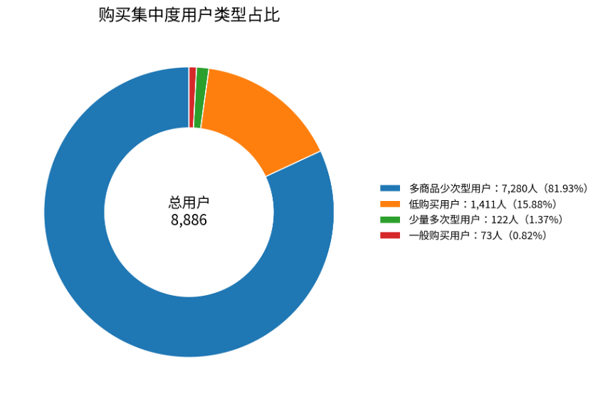
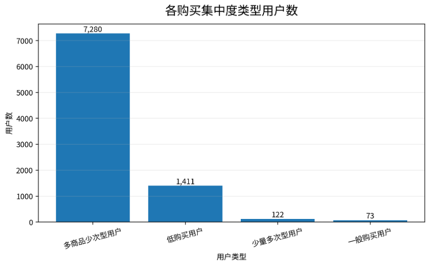
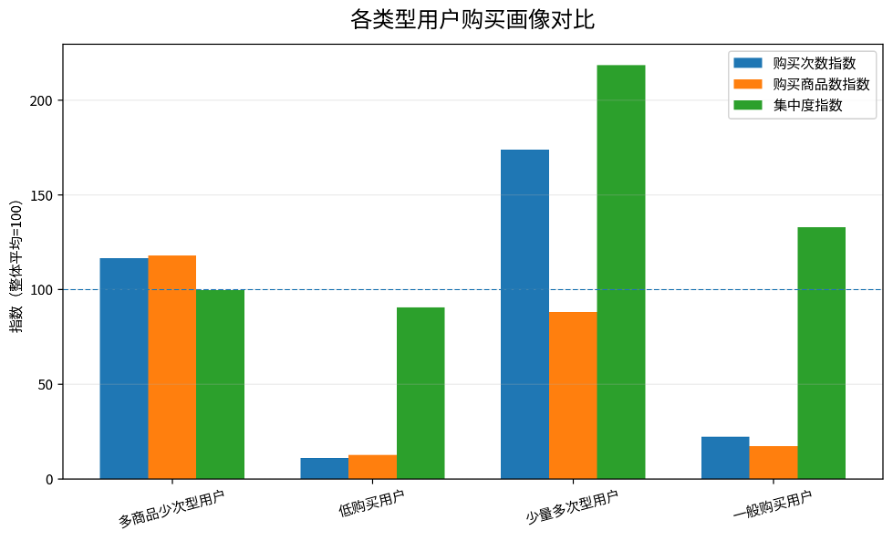

# **用户购买集中度分析报告**

少量多次型用户 vs 多商品少次型用户

# 一、分析结论摘要

本次购买集中度分析共覆盖 8,886 名发生购买行为的用户。结果显示，用户购买行为整体以“多商品少次型用户”为主，共 7,280 人，占比 81.93%；“少量多次型用户”共有 122 人，占比 1.37%，说明真正表现出对少数商品重复购买特征的用户规模较小，但具有较强的复购和偏好稳定性。

低购买用户共有 1,411 人，占比 15.88%。这类用户购买次数不足，购买集中度的解释价值相对有限，后续更适合作为观察或培育对象，而不是直接纳入强偏好用户运营。

抽样验证方面，已从购买集中度结果表中随机抽取 100 名用户回到原始表进行核对，结果均无问题，说明指标计算和用户分类逻辑可靠。

# 二、指标定义与分类口径

用户购买集中度用于衡量用户的购买行为是集中在少数商品上，还是分散在多个商品上。核心指标定义如下：

**购买集中度 = 用户总购买次数 / 用户购买过的不同商品数**

该指标越高，说明用户越倾向于对少数商品进行重复购买；该指标越低，说明用户购买商品更分散，偏向“多商品少次”的购买模式。

| **用户类型** | **规则**                                                                                | **含义**                                   |
| ------------------ | --------------------------------------------------------------------------------------------- | ------------------------------------------------ |
| 低购买用户         | total\_purchase\_count < 3                                                                    | 购买次数较少，暂不适合强判断购买集中偏好         |
| 少量多次型用户     | purchase\_concentration >= 2 且 distinct\_purchase\_item\_count <= total\_purchase\_count / 2 | 对少数商品重复购买，偏好稳定，适合复购运营       |
| 多商品少次型用户   | purchase\_concentration < 2 且 distinct\_purchase\_item\_count >= 3                           | 购买商品种类较多，但单品重复购买较少，偏好更分散 |
| 一般购买用户       | 不满足以上规则的其他购买用户                                                                  | 购买行为介于集中与分散之间                       |

# 三、用户类型分布结果

从用户数量分布看，多商品少次型用户占绝对多数，说明多数购买用户虽然发生过多次购买，但购买对象更分散，单一商品重复购买程度不高。

| **用户类型** | **用户数** | **占比** | **平均购买次数** | **平均购买商品数** | **平均集中度** | **集中度中位数** |
| ------------------ | ---------------- | -------------- | ---------------------- | ------------------------ | -------------------- | ---------------------- |
| 多商品少次型用户   | 7,280            | 81.93%         | 15.80                  | 13.68                    | 1.12                 | 1.06                   |
| 低购买用户         | 1,411            | 15.88%         | 1.48                   | 1.45                     | 1.02                 | 1.00                   |
| 少量多次型用户     | 122              | 1.37%          | 23.53                  | 10.20                    | 2.47                 | 2.17                   |
| 一般购买用户       | 73               | 0.82%          | 3.00                   | 2.00                     | 1.50                 | 1.50                   |

表中可见，少量多次型用户的平均购买集中度为 2.47，显著高于整体平均水平；多商品少次型用户虽然平均购买次数较高，但平均购买商品数也高，因此集中度接近 1，体现出明显的分散购买特征。

# 四、图表分析

图 1 展示各类型用户的数量占比。多商品少次型用户占比最高，是当前购买用户中的主体。

图 1：购买集中度用户类型占比

图 2 展示各类型用户数量对比，可以更直观地看到不同类型用户规模差异。

图 2：各购买集中度类型用户数

图 3 将购买次数、购买商品数和购买集中度转化为指数，整体平均值为 100。少量多次型用户的集中度指数显著高于整体水平，说明其核心特征并非单纯购买次数高，而是购买行为更集中。

图 3：各类型用户购买画像对比

# 五、核心发现与业务解释

• 多商品少次型用户占比达到 81.93%，说明多数用户购买商品较为分散，重复购买同一商品的行为并不占主流。

• 少量多次型用户占比仅为 1.37%，但其平均集中度达到 2.47，具有更稳定的商品偏好和更明确的复购方向。

• 低购买用户占比 15.88%，这类用户购买次数不足，后续可结合活跃度、转化率和最近购买时间进一步判断是否具备培育价值。

• 一般购买用户规模较小，占比 0.82%，其购买行为介于集中购买和分散购买之间，可作为中间过渡人群。

# 六、抽样验证说明

为验证购买集中度结果表的准确性，已从结果表中随机抽取 100 名用户，并回到原始行为明细表中重新统计其总购买次数、不同购买商品数和购买集中度。经对比，抽样用户的计算结果与结果表均一致，说明购买集中度指标和分类结果可靠。

# 七、运营建议

**少量多次型用户：**

适合进行复购提醒、周期性补货推荐、同商品优惠券和高粘性商品维护，重点提升复购频次和留存。

**多商品少次型用户：**

适合进行跨品类推荐、相似商品推荐和组合推荐，重点挖掘其广泛兴趣，提高单品复购或品类复购。

**低购买用户：**

适合结合浏览、收藏、加购等前置行为进行转化培育，不宜仅凭购买集中度判断其偏好。

**一般购买用户：**

可作为潜力观察人群，结合最近购买时间和活跃度判断是否向少量多次或多商品少次方向转化。
