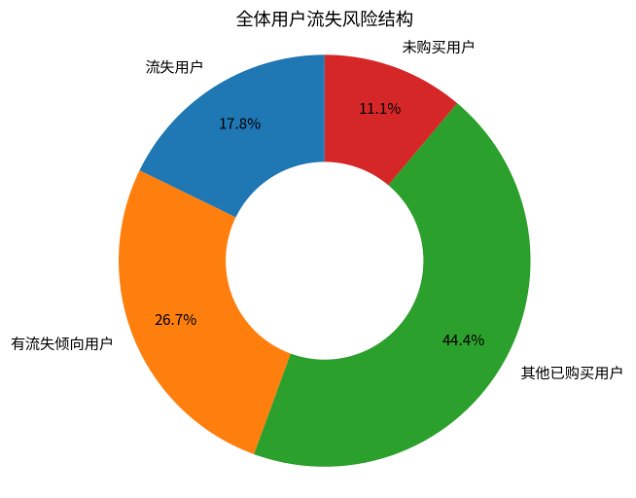
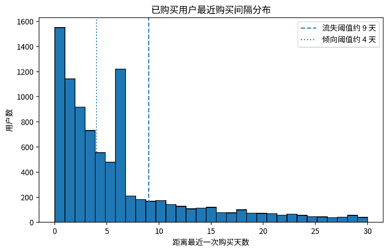
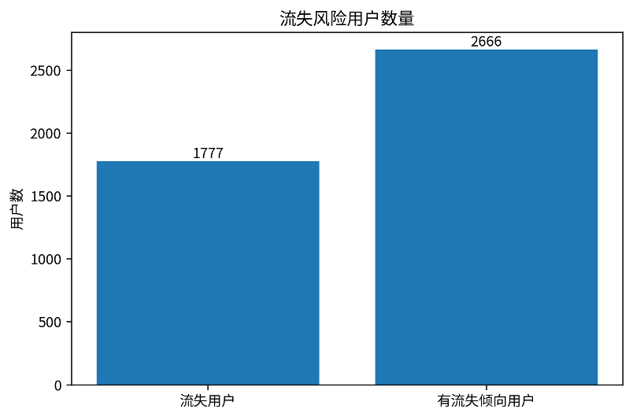
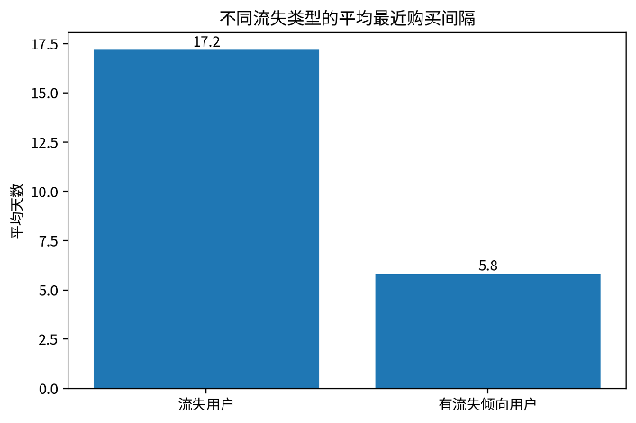
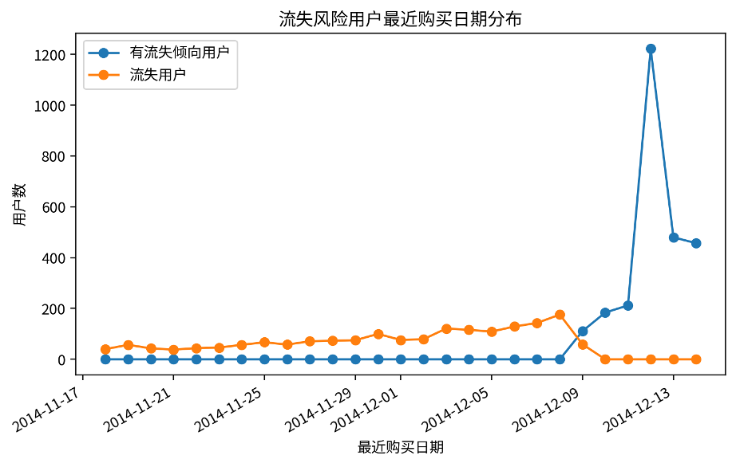

# **流失用户分析报告**

基于最近一次购买时间表、流失用户结果表

# 一、分析目的与核心口径

本报告用于识别具有较高流失风险的购买用户。分析以用户最近一次购买距离调查期结束的时间间隔作为流失风险判断依据。距离最近一次购买越久，说明用户越长时间未产生购买行为，流失风险越高。

* 全体用户数为 10,000 人，其中有购买记录用户 8,886 人，未购买用户 1,114 人。
* 本次流失分层仅针对有购买记录用户进行排序，未购买用户因没有 last\_purchase\_time，不纳入购买后流失用户表。
* 按照 days\_since\_last\_purchase 和 hours\_since\_last\_purchase 从大到小排序，排名前 20% 定义为“流失用户”，20% 至 50% 定义为“有流失倾向用户”，其余用户不保留在流失用户结果表中。

# 二、整体分层结果

| **用户类别** | **用户数** | **占有购买用户比例** | **占全体用户比例** | **平均最近购买间隔** |
| ------------------ | ---------------- | -------------------------- | ------------------------ | -------------------------- |
| 有流失倾向用户     | 2,666            | 30.00%                     | 26.66%                   | 5.82 天                    |
| 流失用户           | 1,777            | 20.00%                     | 17.77%                   | 17.20 天                   |
| 其他已购买用户     | 4,443            | 50.00%                     | 44.43%                   | -                          |
| 未购买用户         | 1,114            | -                          | 11.14%                   | -                          |

*图1 全体用户中的流失风险结构*

# 三、流失阈值与最近购买间隔分布

阈值解释：在有购买记录的 8,886 名用户中，前 20% 流失用户的边界约为最近一次购买距调查结束 9 天、225 小时；前 50% 的边界约为 4 天、98 小时。该边界说明，距调查结束 4 天以上未购买的用户已经进入流失风险关注范围，9 天以上未购买的用户为高风险流失用户。

*图2 已购买用户最近购买间隔分布及流失阈值*

# 四、流失用户与流失倾向用户对比

*图3 流失用户与有流失倾向用户数量对比*

*图4 不同流失风险类型的平均最近购买间隔*

结果解读：流失用户平均最近购买间隔为 17.20 天，明显高于有流失倾向用户的 5.82 天。说明前 20% 用户已经较长时间未出现购买行为，应作为优先召回对象；20% 至 50% 用户虽然尚未进入最高风险区，但购买间隔也已显著拉长，适合进行提前干预。

# 五、最近购买日期分布

*图5 流失风险用户最近购买日期分布*

# 六、方法过程说明

| **步骤**  | **说明**                                                                                     |
| --------------- | -------------------------------------------------------------------------------------------------- |
| 1. 数据来源     | 使用最近一次购买时间表作为基础，读取用户最后一次购买时间、调查期结束时间、距上次购买小时数和天数。 |
| 2. 有效用户筛选 | 保留 days\_since\_last\_purchase 非空用户，即调查期内发生过购买行为的用户。                        |
| 3. 排序规则     | 按 days\_since\_last\_purchase 降序、hours\_since\_last\_purchase 降序、user\_id 升序排序。        |
| 4. 流失分层     | 排序前 20% 标记为流失用户，20% 至 50% 标记为有流失倾向用户。                                       |
| 5. 结果保留     | 仅保留前 50% 的流失风险用户，其余低风险购买用户不进入结果表。                                      |

# 七、运营建议

* 对“流失用户”应优先采用召回策略，例如专属优惠券、短信/站内信提醒、历史购买品类推荐和限时回购权益。
* 对“有流失倾向用户”应采用预防性运营策略，例如新品提醒、加购/收藏商品提醒、会员积分激励和个性化推荐，避免其进一步进入高风险流失区。
* 建议与 RFM 分层、购买频率、行为集中度和最常访问品类结合，进一步区分“高价值流失用户”和“一般流失用户”，从而提高召回资源投放效率。
* 后续可持续监测 days\_since\_last\_purchase 的变化，将流失用户表作为周期性更新的运营名单。

# 八、注意事项

* 本报告中的流失判断是基于历史行为数据的相对排序结果，不代表用户永久流失。
* 未购买用户不纳入本次购买后流失表，但可在用户增长或新客激活分析中单独处理。
* 若后续有更多周期数据，可以将固定前 20%/50% 的相对阈值升级为绝对天数阈值或预测模型。
