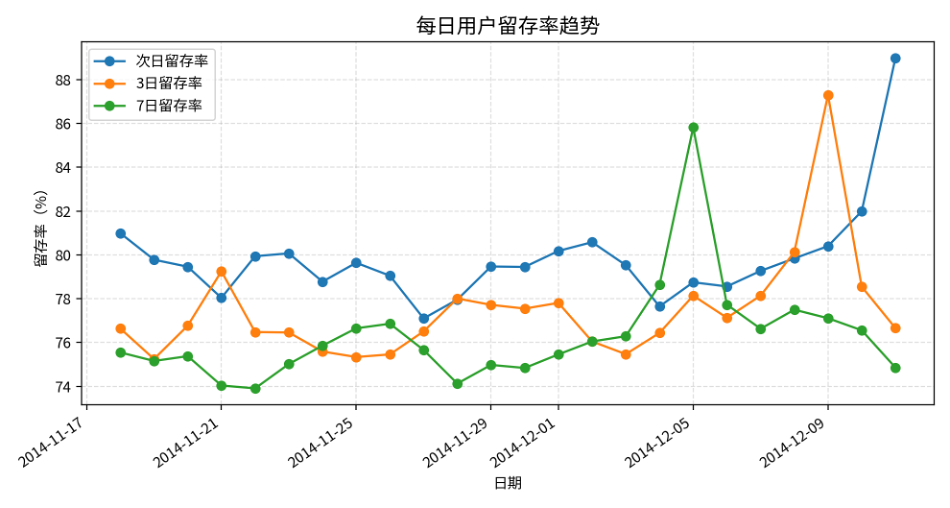
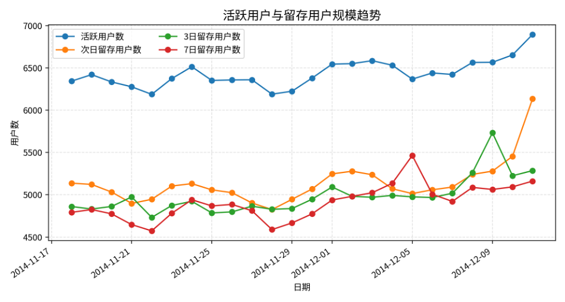
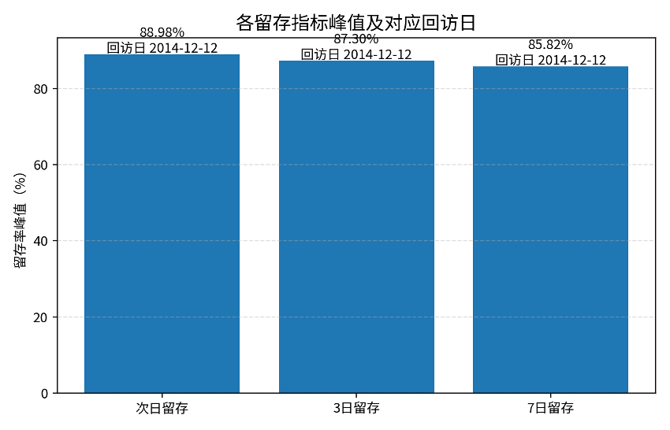
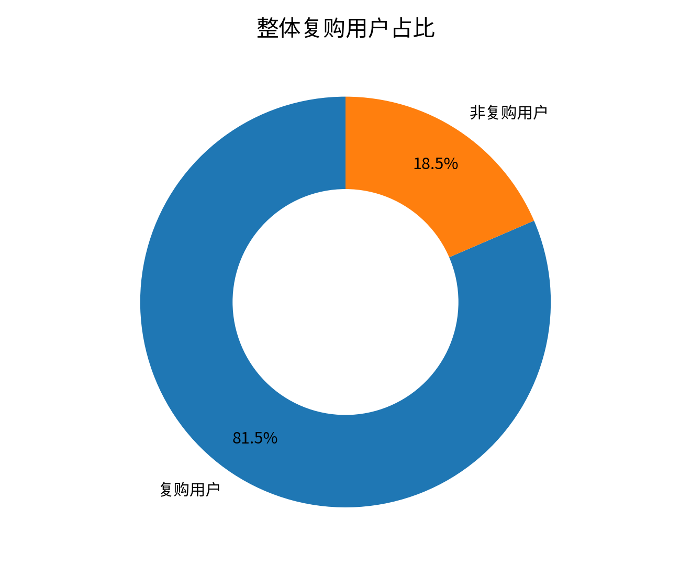

# **留存与复购分析报告**

基于用户行为明细的次日、3日、7日留存与整体复购表现

# 一、分析口径

本报告从用户留存和复购两个角度衡量用户持续活跃与持续购买能力。留存部分以某日发生任意行为的用户作为当日活跃用户，并观察这些用户在第1天、第3天和第7天是否再次发生行为；复购部分以用户在调查期内购买次数是否达到2次及以上作为复购判断标准。

本次留存结果已进行随机抽样验证：从留存率结果表中随机抽取10天，回到原始行为明细表重新统计活跃用户数、1日/3日/7日留存用户数和留存率，返回结果均一致，说明留存率统计逻辑可靠。

| **指标** | **定义**                      |
| -------------- | ----------------------------------- |
| 活跃用户       | 某日发生过任意行为的去重用户数      |
| 次日留存率     | 某日活跃用户在第1天后再次活跃的比例 |
| 3日留存率      | 某日活跃用户在第3天后再次活跃的比例 |
| 7日留存率      | 某日活跃用户在第7天后再次活跃的比例 |
| 整体复购率     | 购买次数≥2的用户数 / 总用户数      |

# 二、留存率总体表现

留存率结果共覆盖 24 个可观察样本日期，日期范围为 2014-11-18 至 2014-12-11。样本期内每日平均活跃用户数为 6434 人，最高活跃用户数出现在 2014-12-11，达到 6894 人。

从留存率均值看，次日留存率为 79.81%，3日留存率为 77.45%，7日留存率为 76.28%。从次日到7日仅下降约 3.53 个百分点，说明用户在短周期内的持续活跃能力较强。

| **指标** | **平均值** | **最小值** | **最小值日期** | **最大值** | **最大值日期** |
| -------------- | ---------------- | ---------------- | -------------------- | ---------------- | -------------------- |
| 次日留存率     | 79.81%           | 77.10%           | 2014-11-27           | 88.98%           | 2014-12-11           |
| 3日留存率      | 77.45%           | 75.25%           | 2014-11-19           | 87.30%           | 2014-12-09           |
| 7日留存率      | 76.28%           | 73.91%           | 2014-11-22           | 85.82%           | 2014-12-05           |

图1 每日用户留存率趋势

从趋势图可以看到，三条留存曲线整体处于较高水平，其中次日留存多数时间高于3日和7日留存。不同留存周期之间并未出现剧烈断崖式下降，说明用户在短期内仍保持较稳定的回访行为。

图2 活跃用户与留存用户规模趋势

# 三、关键峰值与活动影响分析

留存峰值与活动日期之间存在较明显的对应关系：次日留存率最高的样本日为2014-12-11，其第1日回访日对应2014-12-12；3日留存率最高的样本日为2014-12-09，其第3日回访日同样对应2014-12-12；7日留存率最高的样本日为2014-12-05，其第7日回访日也对应2014-12-12。该现象说明双十二节点可能对用户回访产生明显拉动作用。

图3 留存指标峰值与对应回访日

# 四、整体复购表现

整体复购率结果显示，总用户数为 10000 人，其中复购用户数为 8148 人，整体复购率为 81.48%。这说明超过八成用户在调查期内发生了两次及以上购买行为，整体购买粘性较强。

| **指标** | **数值** |
| -------------- | -------------- |
| 总用户数       | 10000          |
| 复购用户数     | 8148           |
| 非复购用户数   | 1852           |
| 整体复购率     | 81.48%         |

图4 整体复购用户占比

# 五、综合结论

第一，用户短期留存表现较好。次日、3日和7日平均留存率分别为 79.81%、77.45% 和 76.28%，整体处于较高水平，说明平台在调查期内具有较强的用户回访能力。

第二，复购水平较高。整体复购率达到 81.48%，说明用户不只是发生一次性购买，而是具有较强的重复购买倾向。结合留存结果看，平台用户同时具备较好的活跃延续性和购买延续性。

第三，活动节点对留存具有明显拉动作用。多个留存峰值的回访日都对应到2014-12-12，这与双十二促销节点高度吻合，说明活动对用户回访和持续活跃具有短期提升效果。

# 六、运营建议

1. 对高活跃但未复购用户，可通过优惠券、商品推荐和加购提醒促进首次复购。
2. 对活动前已活跃用户，可在大促前进行预热触达，因为这类用户在活动日产生回访和购买的概率更高。
3. 对7日留存仍较高的用户，可进一步结合购买频率和RFM分层，识别高价值用户并进行重点维护。
4. 对留存较低日期的用户群体，可分析其行为路径和商品偏好，判断是否存在浏览后未加购、加购后未购买等转化阻滞。

# 七、验证说明

留存率表已采用随机抽样方式进行验证：随机抽取10个 cohort\_date，回到原始 data\_min 表重新计算对应日期的活跃用户数、次日留存用户数、3日留存用户数、7日留存用户数及对应留存率。验证结果均与留存结果表一致，因此可认为留存率统计结果可靠。
