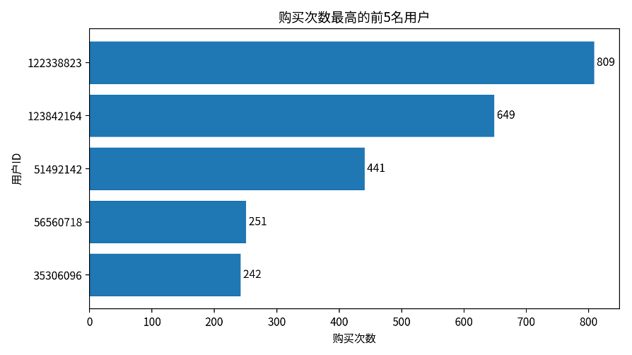
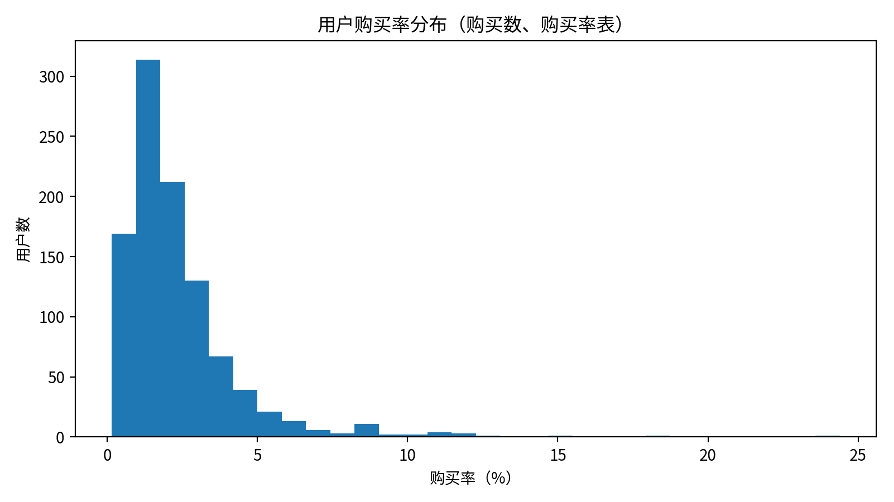
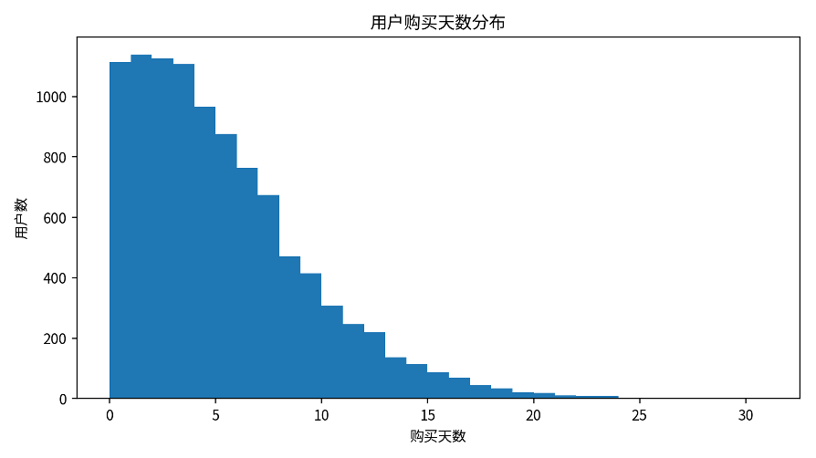
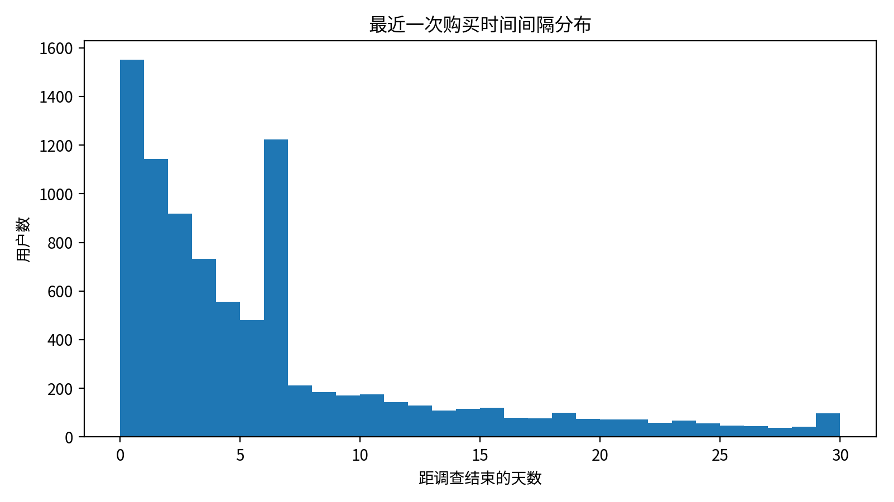

# **用户购买价值分析报告**

基于购买次数、购买率、购买频率与最近一次购买时间

# 一、分析目的与指标口径

本报告围绕用户购买价值进行分析，主要从购买强度、购买效率、购买频率和最近购买时间四个方面刻画用户价值。购买强度关注用户购买次数和购买商品种类数；购买效率关注购买行为在全部行为中的占比；购买频率关注用户在调查期内发生购买的天数及购买日覆盖率；最近购买时间则用于判断用户距离调查期结束时的购买活跃状态。

本报告使用三张结果表：购买数与购买率表、购买频率表、最近一次购买时间表。抽样验证结果显示，三张表均随机抽检100人，回到原始明细表重新计算后全部一致，说明结果表统计口径可靠。

| **指标**     | **结果** | **说明**                           |
| ------------------ | -------------- | ---------------------------------------- |
| 用户覆盖规模       | 10,000         | 购买频率表与最近购买时间表覆盖的用户数量 |
| 有购买用户数       | 8,886          | 占比 88.86%                              |
| 无购买用户数       | 1,114          | 占比 11.14%                              |
| 最高购买次数       | 809            | 来自购买数与购买率表                     |
| 购买率均值         | 2.35%          | 购买次数 / 总行为次数                    |
| 购买天数均值       | 4.92           | 平均每个用户在调查期内发生购买的天数     |
| 最近购买间隔中位数 | 4天            | 仅对有购买用户计算                       |

# 二、购买数与购买率分析

从购买数与购买率表看，样本中用户的平均总行为数为 3,094.62 次，平均购买次数为 49.31 次，购买次数中位数为 41 次。平均购买率为 2.35%，中位购买率为 1.81%。这说明用户购买行为在总行为中的占比整体不高，大量用户仍以浏览、收藏、加购等前置行为为主。

购买次数最高的用户购买次数达到 809 次，明显高于平均水平。这类用户是平台中购买价值较高的核心用户，后续可结合购买商品种类、购买频率和最近购买时间进一步识别高价值稳定用户。

| **用户ID** | **总行为数** | **购买次数** | **购买商品种类数** | **购买率** |
| ---------------- | ------------------ | ------------------ | ------------------------ | ---------------- |
| 122338823        | 10,529             | 809                | 545                      | 7.68%            |
| 123842164        | 12,705             | 649                | 299                      | 5.11%            |
| 51492142         | 9,403              | 441                | 235                      | 4.69%            |
| 56560718         | 6,267              | 251                | 232                      | 4.01%            |
| 35306096         | 3,536              | 242                | 159                      | 6.84%            |

# 三、购买频率分析

购买频率表从“购买天数”角度衡量用户购买行为是否持续发生。统计期内，用户平均购买天数为 4.92 天，中位数为 4 天，最高达到 30 天。购买日频率均值为 15.87%，中位数为 12.90%。

平均每购买日间隔的均值为 10.21 天，中位数为 6.20 天。该指标越小，说明用户购买行为越频繁；该指标越大，说明用户购买行为更稀疏。对于购买天数为0的用户，平均每购买日间隔为空值，避免将无购买用户误判为低频购买用户。

| **指标**       | **数值** |
| -------------------- | -------------- |
| 购买天数均值         | 4.92           |
| 购买天数中位数       | 4              |
| 购买天数最大值       | 30             |
| 购买日频率均值       | 15.87%         |
| 平均每购买日间隔均值 | 10.21天        |
| 无购买用户数         | 1,114          |

# 四、最近一次购买时间分析

最近一次购买时间表用于刻画用户购买行为的新近程度。对有购买记录的用户而言，距离调查结束的最近购买间隔均值为 5.81 天，中位数为 4 天，75分位数为 7 天，最大值为 30 天。

该指标可用于识别近期仍有购买行为的活跃购买用户。间隔越短，说明用户近期购买活跃度越高，短期内继续转化或复购的可能性相对更强；间隔越长，说明用户购买行为距离当前调查期结束较远，可能需要通过召回或促活策略重新激活。

| **指标**       | **数值** |
| -------------------- | -------------- |
| 有购买用户数         | 8,886          |
| 无购买用户数         | 1,114          |
| 最近购买间隔均值     | 5.81天         |
| 最近购买间隔中位数   | 4天            |
| 最近购买间隔75分位数 | 7天            |
| 最近购买间隔最大值   | 30天           |

# 五、抽样验证结论

为验证用户购买价值相关结果表的准确性，分别对购买数与购买率表、购买频率表、最近一次购买时间表随机抽检100名用户，并回到原始行为明细表重新计算对应指标。抽样结果显示三张表均与回溯计算结果一致，说明购买价值指标统计逻辑可靠。

# 六、结论

整体来看，用户购买价值具有明显差异：少数用户贡献了较高购买次数和购买商品种类数，而多数用户购买行为相对分散或频率较低。购买率能够衡量用户行为转化效率，购买频率能够衡量购买持续性，最近一次购买时间能够衡量用户近期价值。将三类指标结合使用，有助于更全面地识别高价值用户、潜力用户和需要召回的用户。
