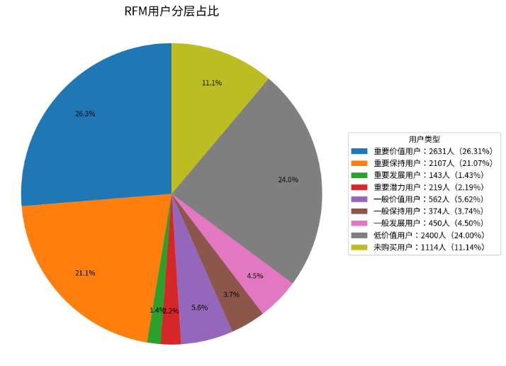
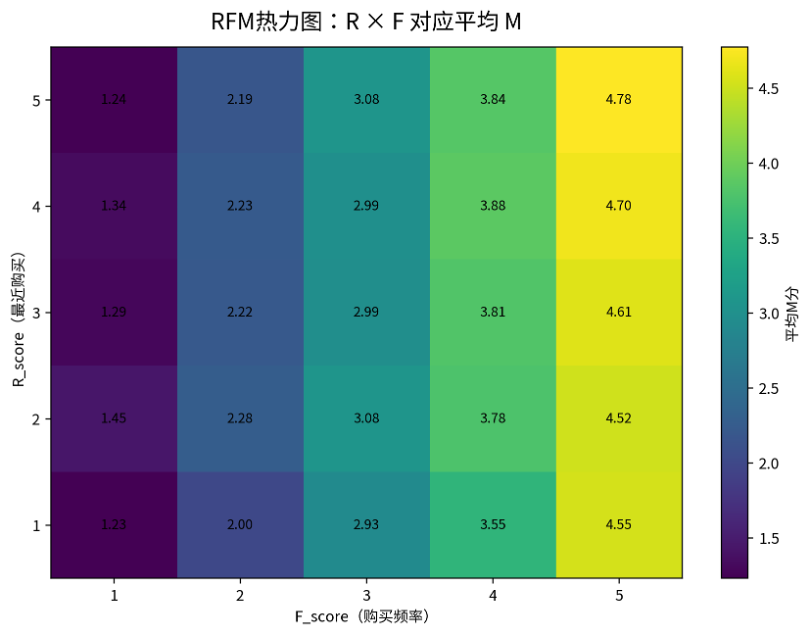
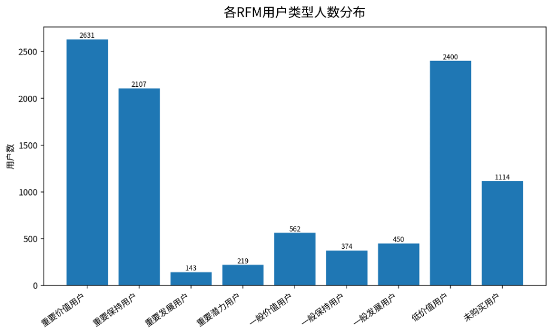

# **RFM用户分层分析报告**

基于最近购买时间、购买频率与购买价值的用户画像分析

本报告基于用户最近一次购买时间、购买频率、购买数与购买率等指标，构建RFM 模型，对用户进行价值分层，并结合分层饼图、RFM 热力图和高价值用户画像图对结果进行解释。

# 一、核心结论

* 本次 RFM 分析共覆盖 10,000 名用户，其中购买用户 8,886 名，未购买用户 1,114 名。
* 重要价值用户共有 2,631 名，占总用户的 26.31%，是当前最值得重点维护的核心客群。
* 重要保持用户占比较高，说明存在一批历史购买价值较强、但最近购买活跃度相对下降的用户，应作为召回和复购运营重点。
* 低价值用户和未购买用户数量仍然较大，说明用户群体中存在明显长尾结构，需要通过低成本触达、兴趣唤醒和首购引导进行分层运营。

# 二、数据来源与指标口径

本次分析使用三类用户购买价值相关数据表：最近一次购买时间表、购买频率表、购买数与购买率表，并以 user\_id 为主键进行合并。RFM 三个核心指标定义如下：

| **维度**    | **使用字段**          | **含义**                                               | **方向** |
| ----------------- | --------------------------- | ------------------------------------------------------------ | -------------- |
| R（Recency）      | days\_since\_last\_purchase | 距离调查期结束最近一次购买过去的天数                         | 越小越好       |
| F（Frequency）    | purchase\_day\_frequency    | 购买天数 / 总调查天数                                        | 越大越好       |
| M（Monetary替代） | purchase\_count             | 调查期内用户购买次数；由于无金额字段，用购买次数替代消费金额 | 越大越好       |

在处理方式上，购买用户参与 RFM 打分，未购买用户单独标记为“未购买用户”。R、F、M 分数采用五分位分层思想生成，并根据 R/F/M 高低组合划分为八类用户。

# 三、RFM用户分层结果总览

| **用户类型** | **用户数** | **用户占比** | **平均距上次购买天数** | **平均购买日频率** | **平均购买次数** | **平均购买天数** |
| ------------------ | ---------------- | ------------------ | ---------------------------- | ------------------------ | ---------------------- | ---------------------- |
| 重要价值用户       | 2,631            | 26.31%             | 0.75                         | 0.30                     | 25.45                  | 9.22                   |
| 重要保持用户       | 2,107            | 21.07%             | 5.95                         | 0.23                     | 16.73                  | 7.05                   |
| 重要发展用户       | 143              | 1.43%              | 1.03                         | 0.10                     | 11.45                  | 2.97                   |
| 重要潜力用户       | 219              | 2.19%              | 0.92                         | 0.15                     | 5.28                   | 4.56                   |
| 一般价值用户       | 562              | 5.62%              | 0.94                         | 0.07                     | 3.18                   | 2.28                   |
| 一般保持用户       | 374              | 3.74%              | 7.57                         | 0.14                     | 5.13                   | 4.41                   |
| 一般发展用户       | 450              | 4.50%              | 8.84                         | 0.09                     | 11.06                  | 2.70                   |
| 低价值用户         | 2,400            | 24.00%             | 12.27                        | 0.06                     | 2.72                   | 1.89                   |
| 未购买用户         | 1,114            | 11.14%             | -                            | 0.00                     | 0.00                   | 0.00                   |

**图1 RFM用户分层占比**

从用户分层占比看，重要价值用户和重要保持用户合计占比较高，说明平台已形成一定规模的购买核心用户与高价值存量用户。同时，低价值用户和未购买用户仍占据较大比例，后续应结合转化路径、活跃度和偏好特征进行精细化培育。

# 四、RFM热力图分析

**图2 RFM热力图：R × F 对应平均M**

热力图以 R\_score 和 F\_score 为二维坐标，以平均 M\_score 表示对应用户群的购买价值水平。颜色越深或数值越高，说明在该 R/F 组合下用户的购买次数表现越强。整体上，F\_score 较高的用户通常具有更高的平均 M\_score，说明购买频率与购买价值之间存在较强关联。

从业务角度看，高 R、高 F、高 M 的用户是重点维护对象；低 R、高 F、高 M 的用户虽然历史表现较好，但近期购买间隔拉长，需要通过召回活动、定向优惠或新品推荐提升复购。

# 五、各类用户运营建议

**图3 各类用户人数分布**

| **用户类型** | **运营建议**                                     |
| ------------------ | ------------------------------------------------------ |
| 重要价值用户       | 重点维护、会员权益、专属推荐、提高复购和客单稳定性     |
| 重要保持用户       | 重点召回、定向优惠、提醒复购，防止高价值用户流失       |
| 重要发展用户       | 强化购买频率，结合周期性推荐和关联商品提升持续购买     |
| 重要潜力用户       | 提升购买深度，推动从低购买量向高购买量转化             |
| 一般价值用户       | 保持触达，结合兴趣偏好进行低成本培育                   |
| 一般保持用户       | 提升近期活跃度，适合使用唤醒型运营                     |
| 一般发展用户       | 历史购买次数较高但近期不足，应判断是否进入沉默期       |
| 低价值用户         | 低成本触达，避免高补贴投入，优先进行兴趣探索           |
| 未购买用户         | 重点进行首购转化设计，如新人券、爆品推荐、降低决策门槛 |

# 六、方法过程与注意事项

* 本次 RFM 采用改进口径：由于数据中没有真实消费金额字段，因此使用 purchase\_count 作为 M 维度的购买价值强度替代指标。
* R 维度中 days\_since\_last\_purchase 数值越小代表用户越近期购买，打分方向与原始数值相反；F 和 M 维度数值越大代表表现越好。
* 未购买用户没有有效的最近购买时间和购买频率，因此不参与购买用户的 RFM 打分，而是单独标记为“未购买用户”。
* 购买率、总行为数、购买商品种类数等字段可作为辅助解释指标，但不直接作为核心 RFM 分层依据。
* 后续若获得真实订单金额，可将 M 维度替换为消费金额或累计成交额，使模型更接近传统 RFM。
